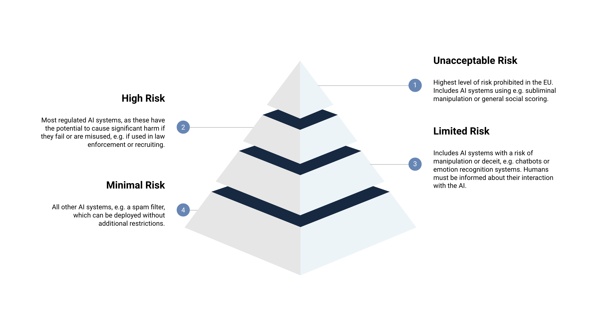

# EU AI act

# EU AI Act – yhteenveto ja soveltaminen

EU AI Act on Euroopan unionin yhteinen tekoälyasetus, joka säätelee sekä tekoälyn kehittämistä että käyttöönottoa. Asetus ei koske vain mallien rakentajia, vaan myös organisaatioita, jotka ottavat tekoälyä käyttöön omissa prosesseissaan.

Asetuksen velvoitteet pätevät kaikkiin tekoälyjärjestelmiin, joita käytetään EU:n alueella tai joita tarjotaan EU:n käyttäjille. Sääntely koskee myös EU:n ulkopuolella kehitettyjä tekoälypalveluita, kuten Yhdysvalloissa, Kiinassa, Aasiassa, Afrikassa tai muissa maissa tuotettuja ratkaisuja, jos niitä käytetään Euroopassa tai jos niitä myydään EU:n markkinoille.

Sääntely perustuu samaan periaatteeseen kuin GDPR: käyttöä ja kohdeyleisöä valvotaan, ei teknologian alkuperämaata. Tämän vuoksi EU AI Actin vaatimukset koskevat kaikkia tekoälypalveluita, jotka toimivat EU:n markkinoilla tai käsittelevät EU:n käyttäjiä koskevaa dataa.

> 📅 Päivitetty tammikuussa 2026. Sisältö perustuu EU AI Actin tilanteeseen kyseisenä ajankohtana. Vaatimukset voivat tarkentua myöhemmin.

> Huomiona: virallinen EU AI Act ‑asetus (tekoälylaki) tuli voimaan 1.8.2024, ja ensimmäiset velvoitteet astuvat voimaan helmikuussa 2025.  

## EU ai act aikajana

EU AI Act hyväksyttiin ja tuli virallisesti voimaan syksyllä 2024. Ensimmäiset velvoitteet astuivat voimaan helmikuussa 2025, ja loput vaatimuksista otetaan käyttöön vaiheittain vuosien 2025–2027 aikana. Tämä tarkoittaa, että sääntely täydentyy ja tarkentuu vielä usean vuoden ajan.

Alla oleva aikajana kuvaa keskeiset päivämäärät:
```EU AI Act – aikajana (täsmällinen ja lyhyt)

1.8.2024  
EU AI Act tuli virallisesti voimaan koko EU:ssa.  
(Tämä on juridinen “laki on nyt olemassa” -päivä.)

EU AI Actin rakenteessa on kolme suurta aaltoa:

1) 2025 – Perusvelvoitteet
- AI-rekisteröinti
- Dokumentointi
- Riskiluokitus
- Läpinäkyvyysvaatimukset
- Tietoturvavelvoitteet
- Kiellettyjen käytäntöjen täyskielto (esim. sosiaalinen pisteytys)

2) 2026 – Valvonta, auditointi ja korkean riskin järjestelmät
Vuoden 2026 aikana voimaan tulevat mm.:
- Korkean riskin AI-järjestelmien tekniset vaatimukset
- Pakolliset riskienhallintaprosessit
- Pakollinen data governance ‑kehikko
- Pakolliset auditointimekanismit
- Velvoitteet AI-järjestelmien jatkuvaan seurantaan
- Velvoitteet käyttäjien informoinnista päätöksenteossa
- Viranomaisten valvontavaltuuksien laajeneminen

3) 2027 – Suurten mallien (GPT-tyyppiset) lisävelvoitteet
Vuonna 2027 odotetaan:
- General-purpose AI (GPAI) ‑mallien erityisvaatimuksia
- Mallien turvallisuustestauksen standardointia
- Mallien läpinäkyvyys- ja dokumentointivaatimusten laajentamista
- Mahdollisia lisävaatimuksia mallien koulutusdatasta
- Velvoitteita mallien riskienhallinnan automatisointiin

```

> 2026 tuo mukanaan korkean riskin järjestelmien tekniset ja hallinnolliset velvoitteet.
> 2027 tuo mukanaan suurten mallien (GPT, Claude, Llama) erityisvaatimukset.

Lisätietoa 
- https://artificialintelligenceact.eu/
- https://valtioneuvosto.fi/-/1410877/eu-n-tekoalyasetus-tekoalykaytantojen-kiellot-astuvat-voimaan-2.2.2025
- https://www.lexfutura.fi/ai-act-kaytannossa-vuonna-2026-mita-organisaation-on-oikeasti-tehtava-nyt
- https://tietosuoja.fi/-/uudet-saannot-vahvistavat-luottamusta-tekoalyyn-tekoalyasetusta-valvovien-viranomaisten-toimivaltuudet-tulivat-voimaan-1.1

---

## Riskiperusteinen luokittelu

EU AI Act jakaa tekoälyjärjestelmät neljään riskiluokkaan. Riskiluokka määräytyy **käyttötarkoituksen**, ei teknologian tai ohjelmointikielen perusteella.

EU AI Act jakaa tekoälyjärjestelmät neljään riskiluokkaan:

| Riskitaso | Esimerkkejä | Velvoitteet |
|-----------|-------------|-------------|
| **Kielletty** | Sosiaalinen pisteytys, manipuloiva AI, biometrinen profilointi | Täysin kielletty |
| **Korkea riski** | Rekrytointi, luottopäätökset, terveydenhuolto, kriittinen infrastruktuuri, robotiikka tietyissä käyttötarkoituksissa | Tiukat vaatimukset: dokumentointi, riskienhallinta, data governance, CE-merkintä |
| **Rajoitettu riski** | Chatbotit, generatiivinen AI, asiakaspalvelubotit, markkinointiautomaatiot | Läpinäkyvyysvaatimukset |
| **Vähäinen riski** | Pelit, suodattimet, sisäiset työkalut, koodigenerointi | Ei erityisiä velvoitteita |

 

## 1. Kielletty AI – lisää esimerkkejä

Kiellettyjä ovat järjestelmät, jotka aiheuttavat merkittävää haittaa perusoikeuksille.

**Lisäesimerkkejä:**
- tunteiden tunnistus työpaikalla tai koulussa  
- reaaliaikainen kasvojentunnistus julkisissa tiloissa (poikkeuksia lukuun ottamatta)  
- haavoittuvien ryhmien manipulointi (lapset, vanhukset)  
- poliittinen manipulointi AI:n avulla  

---

## 2. Korkean riskin AI – laajennettu lista

Korkean riskin AI on se, johon liittyy eniten velvoitteita. Tämä koskee erityisesti yrityksiä, jotka:

- myyvät AI-tuotteita  
- tarjoavat AI-palveluita  
- rakentavat AI:ta kriittisiin prosesseihin  

**Lisäesimerkkejä korkean riskin AI:sta:**

### A) Työelämä ja HR
- rekrytointipäätöksiä tekevät järjestelmät  
- työntekijöiden arviointi  
- automatisoidut soveltuvuustestit  

### B) Rahoitus ja pankkiala
- luottokelpoisuusarviointi  
- lainapäätösten automatisointi  
- petosten tunnistus, jos se vaikuttaa ihmisten oikeuksiin  

### C) Terveydenhuolto
- diagnostiikka  
- hoitosuositukset  
- lääkinnälliset laitteet, joissa on AI-komponentti  

### D) Kriittinen infrastruktuuri
- energia  
- liikenne  
- vesihuolto  
- teollisuusautomaatio  

### E) Robotiikka
Robotiikka voi olla korkean riskin AI, jos se:

- toimii teollisessa ympäristössä  
- voi aiheuttaa fyysistä vahinkoa  
- osallistuu kriittisiin prosesseihin  
- toimii sairaaloissa, tehtaissa tai logistiikassa  

**Esimerkkejä:**
- autonomiset trukit  
- kirurgiset robotit  
- teollisuusrobotit, jotka tekevät päätöksiä itsenäisesti  

---

## 3. Rajoitetun riskin AI – laajennettu lista

Tähän kuuluu suurin osa yritysten käyttämistä AI-järjestelmistä.

**Lisäesimerkkejä:**
- asiakaspalveluchatit  
- markkinointiautomaatio  
- generatiivinen AI (teksti, kuva, ääni)  
- sisällönsuodatus  
- analytiikka, joka ei tee päätöksiä ihmisten puolesta  
- sisäiset työkalut, jotka eivät vaikuta oikeuksiin  

Velvoitteet:  
- käyttäjälle kerrottava, että AI on käytössä  
- sisällön alkuperä ilmoitettava (esim. “tämä teksti on tuotettu AI:n avulla”)  

---

## 4. Vähäisen riskin AI – laajennettu lista

Tähän kuuluu valtaosa ohjelmistoista, joita yritykset rakentavat.

**Lisäesimerkkejä:**
- pelien tekoäly  
- suodattimet (esim. kameran efektit)  
- koodigenerointi (Python, C#, JavaScript jne.)  
- sisäiset automaatiot  
- API-pohjaiset työkalut, jotka eivät tee päätöksiä ihmisten puolesta  
- exe-ohjelmat, jotka eivät vaikuta oikeuksiin  

---

## 5. Miten riskiluokka määräytyy eri toimialoilla?

Riskiluokka ei riipu:

- ohjelmointikielestä  
- siitä, onko kyseessä exe, web-app, API tai mobiilisovellus  
- siitä, myydäänkö lisenssiä vai palvelua  

Riskiluokka riippuu **vain käyttötarkoituksesta**.

### Esimerkkejä toimialoittain:

| Toimiala | Esimerkki | Riskiluokka |
|----------|-----------|-------------|
| Teollisuus | autonominen robotti, joka voi aiheuttaa vahinkoa | Korkea |
| Teollisuus | tuotannon optimointialgoritmi | Rajoitettu / vähäinen |
| Sairaalat | diagnostiikka, hoitosuositukset | Korkea |
| Sairaalat | ajanvaraus-chatbot | Rajoitettu |
| Fitness | treeniohjelman suositus | Rajoitettu |
| Fitness | terveydentilan arviointi | Korkea |
| Konsultointi | sisäinen analytiikkatyökalu | Vähäinen |
| Ohjelmistokehitys | koodigenerointi | Vähäinen |
| Markkinointi | generatiivinen sisällöntuotanto | Rajoitettu |
| Pankki | luottopäätökset | Korkea |
| Valtio | sosiaalietuuksien päätöksenteko | Korkea |
| Valtio | asiakaspalvelubotti | Rajoitettu |

---

## 6. Robotiikka – erityishuomio

Robotiikka kuuluu EU AI Actissa erityistarkasteluun, koska siihen liittyy:

- fyysinen riski  
- turvallisuusvaatimukset  
- mahdollisuus aiheuttaa vahinkoa  

Robotti voi olla:

- **korkean riskin AI**, jos se tekee itsenäisiä päätöksiä  
- **vähäisen riskin AI**, jos se toimii täysin manuaalisesti ilman AI-komponenttia  

## 7. Yhteenveto koskien riskien tasosta

- Riskiluokka määräytyy **käyttötarkoituksen**, ei teknologian perusteella.  
- Sama teknologia voi olla matalan riskin tai korkean riskin AI riippuen siitä, missä sitä käytetään.  
- Toimialat kuten terveydenhuolto, pankit, teollisuus ja julkinen sektori ovat lähes aina korkean riskin alueita.  
- Generatiivinen AI on yleensä rajoitetun riskin AI, ellei sitä käytetä päätöksentekoon.  
- Robotiikka voi olla korkean riskin AI, jos se voi aiheuttaa fyysistä vahinkoa.  

---

## Roolit organisaatiossa

Organisaatio voi olla kahdessa roolissa:

### 1. AI Provider (kehittäjä)
Jos oma malli tai järjestelmä rakennetaan alusta asti, toimitaan kehittäjänä. Velvoitteet määräytyvät riskiluokan mukaan.

- Rekrytointiautomaatiot → korkea riski → laajat velvoitteet  
- Sisäinen generatiivinen assistentti → rajoitettu riski → läpinäkyvyysvaatimukset  

### 2. AI Deployer (käyttäjä)
Jos käyttö perustuu valmiiseen malliin (esim. GPT-4, Claude, Llama), toimitaan käyttäjänä. Velvoitteet ovat kevyemmät, mutta silti:

- käyttö on arvioitava  
- riskit on tunnistettava  
- käyttäjiä on informoitava, jos AI tuottaa sisältöä tai vaikuttaa päätöksiin  

---

## Soveltaminen käytännössä

| Käyttötapa | Rooli | Soveltaminen |
|------------|-------|--------------|
| Oman mallin kehitys | Provider | EU AI Act koskee vahvasti |
| Työkalun rakentaminen GPT:n päälle | Deployer | EU AI Act koskee kevyemmin |
| Valmiin AI-palvelun käyttö | Käyttäjä | Läpinäkyvyys ja riskienhallinta |

---

## Yhteenveto

EU AI Act ei koske vain mallien kehittäjiä. Asetus koskee kaikkia, jotka:

- kehittävät AI-järjestelmiä  
- rakentavat AI-työkaluja  
- tuovat niitä markkinoille  
- integroivat niitä omiin palveluihinsa  

Velvoitteet vaihtelevat roolin ja riskitason mukaan. Shadow AI rikkoo asetusta, jos käyttö ei ole rekisteröityä, dokumentoitua, valvottua tai riskiluokiteltua.


