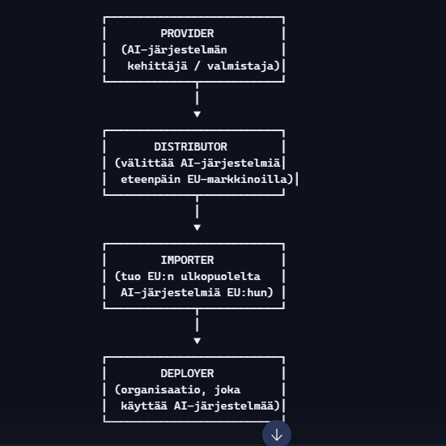

# EU AI Act – roolit, virheelliset tulkinnat ja soveltamisen riskit

Tässä osiossa kuvataan, ketä EU AI Act koskee, mitä rooleja organisaatioilla voi olla, ja mitkä ovat yleisimmät virheet lain soveltamisessa. Sisältö perustuu asiantuntija-arvioihin ja EU AI Actin rakenteeseen.

Kappaleessa käsitellään lyhyesti tehtävien rooleja ja sitä, ketä ne voivat koskea. Vaikka tehtävänimikkeet eivät ole kiveen hakattuja, EU AI Actin velvoitteet voivat koskea laajasti organisaation henkilöstöä – ei vain teknisiä kehittäjiä tai johtoa. Tavoitteena on ymmärtää, että EU AI Act koskee myös yrityksen sisäisiä käyttäjiä, jotka toimivat tekoälyn kanssa osana työtehtäviään.

> 📅 Päivitetty tammikuussa 2026. Sisältö ja vaatimukset voivat muuttua tai tarkentua vaiheittain.

---

## Ketä EU AI Act koskee?

EU AI Act ei koske yksittäisiä kuluttajia tai yksityishenkilöitä lain velvoitteiden tasolla.  
Sen sijaan se koskee organisaatioita ja toimijoita, jotka:

- kehittävät tekoälyjärjestelmiä (provider)  
- ottavat käyttöön tekoälyjärjestelmiä (deployer)  
- tuovat AI-järjestelmiä markkinoille EU:ssa  
- toimivat jakelijoina tai maahantuojina  
- tarjoavat general-purpose AI -malleja (esim. GPT-4, Claude, Llama)

Yksittäinen henkilö, joka käyttää valmista AI-palvelua (esim. ChatGPT, Copilot, Midjourney), ei ole lain kohde.

---

## Organisaation roolit – kaaviomainen jäsennys

| Rooli        | Kuvaus                                                                 | Esimerkki                                               |
|--------------|------------------------------------------------------------------------|----------------------------------------------------------|
| Provider     | Kehittää oman AI-järjestelmän tai mallin                               | Yritys rakentaa oman rekrytointimallin                  |
| Deployer     | Ottaa käyttöön valmiin AI-järjestelmän                                 | Yritys käyttää GPT-pohjaista työkalua rekrytoinnissa    |
| Jakelija     | Välittää AI-järjestelmiä EU-markkinoille                               | Teknologiatoimittaja tuo AI-tuotteen EU:hun             |
| Maahantuoja  | Tuo AI-järjestelmiä EU-alueelle                                         | EU:ssa toimiva yritys tuo ulkomaisen AI-järjestelmän    |
| GPAI-tarjoaja| Kehittää yleiskäyttöisiä malleja (GPT, Claude, Llama)                  | Mallin kehittäjä, joka tarjoaa teknologian EU:ssa       |

---

## Henkilökohtainen käyttö vs. organisaation käyttö

EU AI Act ei tee eroa henkilön statuksen mukaan (työntekijä, opiskelija, harrastaja).  
Ero tehdään sen mukaan, käytetäänkö AI:ta organisaation puolesta vai yksityisesti.

- Jos AI:ta käytetään organisaation puolesta → vastuu on organisaatiolla  
- Jos AI:ta käytetään yksityishenkilönä → laki ei velvoita käyttäjää  

---

## Yleisimmät virheet EU AI Actin soveltamisessa

⚠️ Yleisin virhe: Organisaatio ei tunnista omaa rooliaan (provider vs. deployer).  
Tämä johtaa seuraaviin ongelmiin:

- velvoitteet arvioidaan väärin  
- riskiluokka tulkitaan virheellisesti  
- dokumentaatio jää puutteelliseksi  
- läpinäkyvyysvelvoitteet unohtuvat  
- AI otetaan käyttöön ilman vaikutusarviointia  

Tämä virhe on todennäköisin ja aiheuttaa eniten sanktioita.

---

## Arvio virheiden todennäköisyydestä (asiantuntija-arviot)

📉 Arvioitu virheiden todennäköisyys:

- 60–80 % yrityksistä tekee alkuvaiheessa virheitä roolituksessa  
- 60 % arvioi dokumentaatiovaatimukset väärin  
- 30–50 % ei tee vaikutusarviointia ajoissa  
- 40–60 % ei tiedosta, että käytetty AI kuuluu korkean riskin luokkaan  

Nämä luvut perustuvat asiantuntijakokemukseen ja konsulttitalojen arvioihin (EY, OnSecurity), eivät virallisiin tilastoihin.

---

## Miksi virheitä tapahtuu?

Virheiden taustalla on se, että EU AI Act:

- on laaja ja tekninen  
- sisältää useita rooleja ja velvoitetasoja  
- tuo velvoitteita eri käyttäjäryhmille  
- astuu voimaan vaiheittain  
- tuo velvoitteita pelkästä AI:n käytöstä  

Organisaatiot eivät ole tottuneet siihen, että pelkkä AI:n käyttö voi tuoda sääntelyvelvoitteita.

---

# 🟦 1. Roolikaavio: Provider / Deployer / Distributor / Importer

(EU AI Actin virallisen roolijaon pohjalta)
Roolikaavio (tekstimuotoinen, selkeä ja yksiselitteinen)

 

Roolien selitykset:
- Provider Rakentaa, kehittää tai julkaisee AI-järjestelmän. Vastaa teknisestä dokumentaatiosta, riskienhallinnasta ja vaatimustenmukaisuudesta.
- Distributor Ei kehitä, mutta välittää AI-järjestelmiä eteenpäin (esim. jälleenmyyjä, konsulttitalo, joka myy AI-tuotteita).
- Importer Tuo EU:n ulkopuolelta AI-järjestelmiä EU-markkinoille.
- Deployer Käyttää AI-järjestelmää omassa toiminnassaan (yritys, kunta, oppilaitos, palveluntarjoaja).

## 🔷 Riskiluokitusmatriisi  
*(EU AI Actin virallinen riskiperusteinen malli)*

| Riskitaso         | Esimerkkejä                                               | Velvoitteet                                                                 |
|-------------------|-----------------------------------------------------------|------------------------------------------------------------------------------|
| Kielletty         | Sosiaalinen pisteytys, manipuloiva AI, biometrinen profilointi | Täyskielto                                                                  |
| Korkea riski      | Rekrytointi, luottopäätökset, koulutusarviointi, terveydenhuolto, kriittinen infrastruktuuri | Tiukat vaatimukset: dokumentaatio, riskienhallinta, data governance, lokitus, ihmisen valvonta |
| Rajoitettu riski  | Chatbotit, generatiivinen AI, deepfake-sisältö            | Läpinäkyvyys: kerrottava käyttäjälle, että AI tuottaa sisältöä              |
| Vähäinen riski    | Pelit, suositusalgoritmit, ei-päätöksentekoon vaikuttavat AI:t   | Ei erityisiä velvoitteita                                                   |

---

## 🔶 Checklist: konsultti, admin, palveluntarjoaja  
*(Käytännönläheinen, suoraan käyttöön)*

### Konsultti

- [ ] Asiakkaan rooli tunnistettu (provider / deployer / distributor / importer)  
- [ ] AI-järjestelmän riskiluokka tunnistettu  
- [ ] Vaikutusarviointi tehty (AI Impact Assessment)  
- [ ] Dokumentaatio ja läpinäkyvyyden toteutuminen varmistettu  
- [ ] Tekninen ja organisatorinen henkilöstö koulutettu  
- [ ] Asiakkaan prosessien yhteensopivuus AI Act -vaatimusten kanssa varmistettu  
- [ ] Henkilötiedon rooli huomioitu riskien arvioinnissa  

### Admin (IT / tietoturva / infra)

- [ ] AI-järjestelmät inventoitu  
- [ ] Pääsynhallinta ja lokitus toteutettu  
- [ ] Datan laatu ja datalähteiden hallinta varmistettu  
- [ ] Tekniset kontrollit toteutettu (DLP, CASB, SSO, auditointi)  
- [ ] Järjestelmät ja riskit dokumentoitu  
- [ ] Kiellettyjen toimintojen estäminen varmistettu  

### Palveluntarjoaja (MSP, IT-palvelut, SaaS-toimija)

- [ ] Oma rooli määritelty (usein distributor + deployer)  
- [ ] Asiakkaalle tarjottu AI on vaatimustenmukainen  
- [ ] Asiakkaalle toimitettu dokumentaatio ja läpinäkyvyys  
- [ ] Asiakkaan AI Act -vastuut tunnistettu  
- [ ] Asiakkaan data käsitelty lain mukaisesti  
- [ ] Jatkuva valvonta ja riskienhallinta toteutettu  

---

## 🔷 Esimerkkitapaukset  
*(rekrytointi, asiakaspalvelu, sisäinen assistentti, automaatio)*

### 1) Rekrytointi (High-risk)

- CV-seulonta AI:lla → korkean riskin järjestelmä  
- Velvoitteet: dokumentaatio, ihmisen valvonta, datan laatu, auditointi  
- Rooli: deployer (jos käytetään), provider (jos rakennetaan itse)

### 2) Asiakaspalvelu (Limited risk)

- Chatbot vastaa asiakkaiden kysymyksiin  
- Velvoite: kerrottava, että käyttäjä keskustelee AI:n kanssa  
- Rooli: deployer

### 3) Sisäinen assistentti (Limited risk)

- GPT-pohjainen työkalu  
- Velvoitteet: läpinäkyvyys, datan hallinta  
- Rooli: deployer

### 4) Automaatio (käyttötarkoituksesta riippuen)

- Prosessiautomaatio ilman päätöksentekoa → vähäinen riski  
- Päätöksenteko ihmisiin vaikuttavissa asioissa → korkea riski  
- Rooli: deployer tai provider

---

## 🔶 Organisaatiokohtainen tulkinta

Tulkinta perustuu siihen, että työskentely tapahtuu:

- teknisen asiantuntijan roolissa  
- arkkitehtuurin, automaation ja turvallisuuden parissa  
- konsulttina ja palveluntarjoajien rajapinnassa  
- politiikan ja ohjeistusten laatijana organisaatiolle  

### Tyypilliset roolit organisaatioympäristössä:

#### 1) Deployer

Kun organisaatiossa käytetään AI-ratkaisuja, kuten:

- Copilot  
- GPT-pohjaiset työkalut  
- automaatio  

→ velvoitteet: riskienhallinta, dokumentaatio, läpinäkyvyys, datan hallinta

#### 2) Distributor / Service Provider

Kun AI-ratkaisuja tarjotaan asiakkaille:

- integraatio  
- automaatio  
- AI-avusteiset palvelut  

→ velvoitteet: varmistettava, että asiakkaalle tarjottu AI on vaatimustenmukainen

### Provider-rooli

Tulee sovellettavaksi vain, jos AI-järjestelmä tai malli rakennetaan itse.

----

# MINIMIVELVOITTEET YRITYKSISSÄ

EU AI Actin mukaan yritys kuuluu provider-rooliin, jos:

1. Rakennetaan oma AI-työkalu  
2. Aiotaan myydä sitä EU:n ulkopuolelle  

EU:n virallisissa lähteissä, erityisesti EU:n digitaalisen strategian sivuilla, on listattu GPAI-mallien tarjoajien velvoitteet sekä AI Actin artiklat, jotka määrittelevät provider-velvoitteet korkean riskin järjestelmille.

---

## 🟦 1. Minimivelvoitteet, jos yritys rakentaa oman AI‑työkalun (provider)

EU:n virallisiin lähteisiin, erityisesti EU:n digitaalisen strategian sivuihin ja AI Actin artikloihin, on määritelty provider‑roolin velvoitteet. Velvoitteet koskevat kaikkia yrityksiä, jotka kehittävät AI‑järjestelmän EU:n sisällä, riippumatta siitä, missä maassa asiakkaita on tai millä mallilla palvelua myydään (kuukausilisenssi, vuosilisenssi, kertamaksu tai SaaS‑malli).

Tämä tarkoittaa käytännössä sitä, että EU:ssa toimivan yrityksen on noudatettava AI Actin vaatimuksia aina, kun oma AI‑työkalu tai -järjestelmä tuodaan markkinoille. Velvoitteet eivät riipu siitä, onko kyseessä pieni sovellus, sisäinen työkalu, kaupallinen tuote tai laaja AI‑palvelu. Velvoitteet syntyvät myös silloin, kun järjestelmää tarjotaan maksullisena versiona tai lisenssimallina.

Provider‑rooliin liittyy useita käytännön kysymyksiä ja riskejä, kuten:

- teknisten vaatimusten täyttäminen  
- dokumentaation ja datayhteenvetojen laatiminen  
- sopimusten ja lisenssiehtojen päivittäminen  
- tietoturvan ja robustisuuden varmistaminen  
- mahdollisten haavoittuvuuksien ja riskien arviointi  
- testauksen ja validoinnin toteuttaminen  
- läpinäkyvyyden ja käyttäjäinformoinnin varmistaminen  

> Nämä velvoitteet koskevat kaikkia EU:ssa kehitettyjä AI‑järjestelmiä, riippumatta siitä, myydäänkö niitä EU:n sisällä vai ulkopuolelle.

Velvoitteet riippuvat siitä, onko kyseessä:

- General-purpose AI (GPAI) – yleiskäyttöinen malli  
- High-risk AI – esim. rekrytointi, luottopäätökset  
- Limited risk – chatbotit, generatiivinen AI  
- Minimal risk – ei velvoitteita  

Providerilla on aina vähimmäisvelvoitteita, vaikka malli olisi yleiskäyttöinen.

---

## 🧠 A. Minimivelvoitteet kaikille GPAI-mallien tarjoajille

(EU:n virallinen lista)

- Tekninen dokumentaatio  
- Toteutettu tekijänoikeuspolitiikka  
- Koulutusaineiston yhteenveto  

Nämä ovat vähimmäisvaatimukset, vaikka malli ei olisi korkean riskin.

---

## 🚨 B. Jos malli on korkean riskin (High-risk AI)

(velvoitteet määritelty AI Actin artiklassa 16)

Providerin on toteutettava:

- Riskienhallintajärjestelmä  
- Datan laatu ja hallinta  
- Dokumentaatio ja läpinäkyvyys  
- Lokitus ja jäljitettävyys  
- Ihmisen valvonta  
- Kyberturvallisuus ja robustisuus  

Nämä ovat merkittävästi raskaampia kuin GPAI-mallien minimivaatimukset.

---

## 💬 C. Jos malli on vain "limited risk" (esim. generatiivinen AI)

(velvoitteet tulevat läpinäkyvyysartiklasta 50)

- Kerrottava käyttäjälle, että AI on vuorovaikutuksessa AI:n kanssa  
- Merkittävä syntetisoitu sisältö (deepfake-merkinnät)  
- Kerrottava, jos käytetään tunteiden tunnistusta tai biometriaa  

---

## 🟩 2. Minimivelvoitteet, jos yritys aikoo myydä AI-työkalua EU:n ulkopuolelle

Tämä on tärkeä kohta: EU AI Act koskee vain EU-markkinoita.  
Mutta jos järjestelmä kehitetään EU:ssa, yritys on silti provider, vaikka myynti suuntautuisi ulkomaille.

---

## 🧠 A. Mitä EU vaatii, jos myynti tapahtuu EU:n ulkopuolelle?

### 1) Provider-velvoitteet säilyvät, koska kehitys tapahtuu EU:ssa

- Tekninen dokumentaatio  
- Datayhteenveto  
- Copyright-politiikka  
- Riskienhallinta (jos korkean riskin malli)

### 2) EU ei säätele ulkomaan markkinoita

- USA:lla ei ole vielä liittovaltiotason AI-lakia  
- Kiinassa GPAI-malleille on erityisiä rajoituksia  
- Britanniassa kevyempi riskiperusteinen malli  
- Kansainväliset järjestöt (esim. AINs) antavat suosituksia  

EU ei säätele vientiä, mutta velvoitteet säilyvät, jos kehitys tapahtuu EU:ssa.

---

## 🔁 B. Jos malli myydään EU:n ulkopuolelle, mutta se tuodaan takaisin EU-markkinoille

→ silloin AI Act pätee jälleen.

---

## 📦 3. Yhteenveto: Minimivelvoitteet yritykselle, joka rakentaa oman AI-työkalun

### A. Minimivelvoitteet kaikille AI-kehittäjille (provider)

Perustuen EU:n viralliseen GPAI-velvoitelistaan:

- Tekninen dokumentaatio  
- Tekijänoikeuspolitiikka  
- Koulutusaineiston yhteenveto  

### B. Jos malli on korkean riskin

Perustuen AI Actin artiklaan 16:

- Riskienhallinta  
- Datan laatu  
- Lokitus  
- Läpinäkyvyys  
- Ihmisen valvonta  
- Kyberturvallisuus  

### C. Jos malli on limited risk

Perustuen artiklaan 50:

- Läpinäkyvyys  
- Deepfake-merkinnät  
- Ilmoitus AI-vuorovaikutuksesta  

### D. Myynti EU:n ulkopuolelle

- EU ei rajoita vientiä  
- Provider-velvoitteet säilyvät, koska kehitys tapahtuu EU:ssa  
- Kohdemaan laki voi tuoda lisävaatimuksia  

---

## 🟦 Milloin yritys on lain piirissä?

- Jos yritys kehittää omaa AI:ta → kuuluu suoraan lain piiriin (“provider”)  
- Jos yritys ottaa käyttöön jonkun muun AI-järjestelmän (esim. ostettu, SaaS, open source) → kuuluu lain piiriin “deployer”-roolissa, jos käyttö on riskiluokassa  
- Jos AI on integroitu omaan tuotteeseen → kuuluu lain piiriin  
- Jos yritys tarjoaa AI-palvelua asiakkaille → kuuluu lain piiriin  

---

## 🟩 Milloin yritys EI yleensä ole lain piirissä?

- Jos AI:ta käytetään vain matalan riskin sisäisiin tarkoituksiin (esim. tekstin tiivistys, käännökset, ideointi) → velvoitteet ovat minimissään  
- Jos yritys ei kehitä eikä tarjoa AI-järjestelmiä, vaan käyttää niitä kuten mitä tahansa työkalua → velvoitteet ovat vähäiset

---

## 🧩 EU AI Act – IT/ICT-palvelut, ohjelmistokehitys ja konsultointi

Yksi yleisimmistä väärinkäsityksistä EU AI Actista liittyy siihen, koskeeko laki IT/ICT-palveluita, ohjelmistokehitystä tai konsultointia. Tämä kysymys nousee jatkuvasti esiin, ja siksi se on tärkeä selventää.

---

### 1. Koskeeko EU AI Act IT/ICT-palveluita?

Kyllä, mutta vain tietyissä rooleissa. IT/ICT-palvelut kuuluvat AI Actin piiriin vain silloin, kun ne:

- **Kehittävät tai rakentavat AI-järjestelmän**  
  → Provider  
  Esim. yritys rakentaa oman tekoälymallin, AI-pohjaisen palvelun tai AI-ominaisuuden.

- **Ottavat AI-järjestelmän käyttöön asiakkaalle**  
  → Deployer  
  Esim. IT-palveluyritys asentaa, konfiguroi tai integroi AI-työkalun asiakkaalle.

- **Välittävät AI-järjestelmiä eteenpäin**  
  → Distributor  
  Esim. MSP myy AI-pohjaista SaaS-ratkaisua.

- **Tuovat AI-järjestelmiä EU:n ulkopuolelta**  
  → Importer

Jos mikään näistä ei toteudu, AI Act ei koske kyseistä IT-palvelua.

---

### 2. Koskeeko AI Act ohjelmistoyritystä?

Tämä riippuu yhdestä asiasta:

🔥 **Sisältyykö ohjelmistoon tekoälyä?**

- Jos EI sisälly →  
  ❌ AI Act ei koske yritystä.  
  Ohjelmistokehitys ilman tekoälyä ei kuulu lain piiriin.

- Jos SISÄLTYY →  
  ✅ AI Act koskee yritystä, koska yritys on silloin:  
  - Provider, jos AI-järjestelmä rakennetaan  
  - Deployer, jos AI:ta käytetään omassa toiminnassa  
  - Distributor, jos AI-järjestelmiä myydään eteenpäin

---

### 3. Ydinperiaate, joka kannattaa muistaa

**EU AI Act koskee vain tekoälyä.**  
Jos yritys ei rakenna, käytä tai myy tekoälyä, laki ei koske sitä.

---

### 4. Taulukko: Koskeeko AI Act meitä?

| Tilanne | Koskeeko AI Act? | Perustelu |
|--------|-------------------|-----------|
| IT-tuki, ylläpito, verkot, infra | ❌ Ei | Ei tekoälyä |
| Tavallinen ohjelmisto ilman AI:ta | ❌ Ei | Ei tekoälyä |
| Copilotin, ChatGPT:n, Midjourneyn käyttö | ✅ Kyllä | Deployer-rooli |
| Oman AI-mallin rakentaminen | ✅ Kyllä | Provider-rooli |
| AI-ominaisuuden lisääminen tuotteeseen | ✅ Kyllä | Provider-rooli |
| AI-pohjaisen SaaS-palvelun myynti | ✅ Kyllä | Provider + distributor |
| AI-työkalun integrointi asiakkaalle | ✅ Kyllä | Deployer-rooli |
| AI-järjestelmän tuonti EU:n ulkopuolelta | ✅ Kyllä | Importer-rooli |

---

### 5. AI:n käyttö ja deployer-rooli

EU AI Act koskee myös yrityksiä, jotka vain **käyttävät** tekoälyä.  
Esimerkiksi yritys, joka käyttää:

- Copilotia  
- ChatGPT:tä  
- AI-pohjaista rekrytointityökalua  
- AI-pohjaista asiakaspalvelubottia  

→ kuuluu deployer-rooliin.  
Velvoitteet ovat kevyempiä kuin providerilla, mutta ne ovat silti voimassa.

---

### 6. Tiivistetty vastaus

**EU AI Act koskee yritystä vain, jos se rakentaa, käyttää, myy tai tuo tekoälyä.**  
Jos AI:ta ei ole, laki ei koske yritystä.  
Jos AI:ta on, velvoitteet ovat voimassa.

