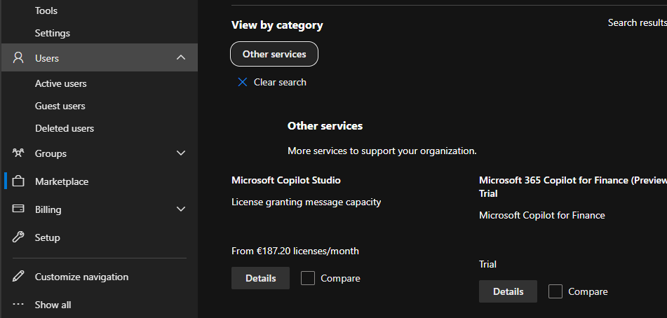
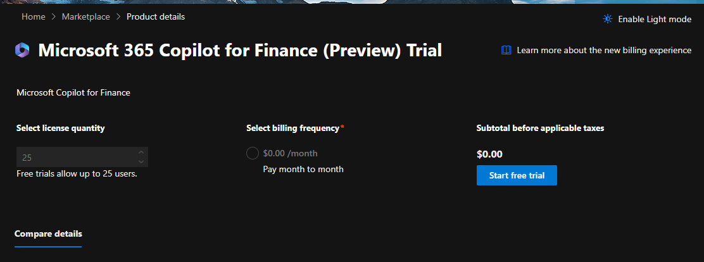
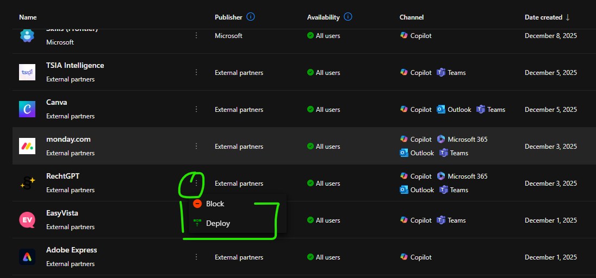

# Admin centerin copilot

> Pieni huomio nämä kuvat ovat tammikuu 2026 ajalta

Tässä osiossa kuvataan Microsoft 365 Admin Centerin Copilot‑näkymää, jossa on erillinen välilehti lisenssien hallintaan. Välilehti toimii hieman samaan tapaan kuin Marketplace, eli sen kautta voi:
- tarkastella saatavilla olevia lisenssejä
- tehdä uusia tilauksia
- nähdä lisätietoja tuotteista
- käynnistää ilmaisia kokeiluversioita (trial)

Useimmilla tuotteilla on noin kuukauden mittainen kokeilujakso. Ajantasaiset hinnat, kokeilujen kesto ja muut ehdot kannattaa aina tarkistaa Microsoftin omasta Marketplace‑sivustosta, koska tiedot voivat muuttua.

 

---

# Copilot Studio ‑lisensointi ja kokeiluversiot
Microsoft Copilot Studio ‑työkalun käyttö edellyttää voimassa olevia lisenssejä tai tilausta. Työkalua ei enää tarjota täysin ilmaisena versiona ilman ehtoja.

## Kokeiluversio
Copilot Studioa voidaan kokeilla maksutta rajoitetun ajan. Kokeilujakso kestää tyypillisesti noin 30 päivää. Kokeiluversio mahdollistaa agenttien luomisen ja testauksen, mutta ei välttämättä tue kaikkia tuotantokelpoisia julkaisuja. Kokeilun käyttö edellyttää Azure‑tiliä, jossa on määritetty laskutusasetukset.

## Lisenssivaatimukset
Copilot Studion käyttöön liittyy kaksi pääasiallista lisenssityyppiä:

- Käyttäjälisenssi (User License)  
  - Käyttäjälisenssi vaaditaan, jotta henkilö voi käyttää Studioa. Lisenssi on teknisesti maksuton, mutta sen käyttö edellyttää, että tenantissa on aktivoitu Copilot Studio ‑ympäristö (esim. Copilot Credits tai Microsoft 365 Copilot).

- Tenant‑lisenssi / Copilot Credit ‑paketti  
  - Tenant‑lisenssi tarvitaan, jotta ympäristö voidaan aktivoida ja agenttien käyttö tuotannossa mahdollistetaan. Tämä lisenssi on maksullinen ja se voi perustua kapasiteettipakettiin (esim. ~200 $/kk) tai kulutusperusteiseen malliin (pay‑as‑you‑go). Lisenssi antaa käyttöön Copilot Credits ‑yksiköitä agenttien ajoa varten.

## Huomioita
Aiemmin on ollut saatavilla ns. “viral trial” ‑lisenssejä, joita jaettiin laajasti ilman maksua. Microsoft on kuitenkin muuttanut lisenssikäytäntöjä, eikä kyseistä versiota enää virallisesti tarjota.

Copilot Studioa ei voida käyttää täysin ilmaisena “standalone studio” ‑ratkaisuna ilman ehtoja. Käyttö edellyttää joko Microsoft 365 Copilot ‑lisenssiä tai erillistä Copilot Studio ‑tenant‑pakettia sekä siihen liittyvää käyttäjälisenssiä.

 

 

# Agenttien hallinta: Block ja Deploy ‑asetukset

Microsoft Copilotissa agenttien hallinta perustuu samoihin periaatteisiin kuin sovellusten käyttöoikeuksiin. Agenttien käyttöä voidaan hallita kahdella pääasetuksella:

## ❌ Block

Agentin käyttö estetään koko organisaatiossa tai tietyillä käyttäjillä.

- Agentti ei ole käytettävissä
- Käyttö ei näy Copilotissa
- Estetään myös ns. "shadow AI" ‑käyttö, jossa käyttäjä yrittäisi lisätä agentin itse

## ✅ Deploy

Agentti otetaan käyttöön valituille käyttäjille tai ryhmille.

- Käyttö näkyy Copilotissa (esim. Teams, Microsoft 365, Outlook)
- Agenttia ja sen tietoja voidaan käyttää

---

## Käytännön esimerkki: 5 henkilöä ja 5 sovellusta

Alla on kuvattu, miten Block ja Deploy ‑asetukset vaikuttavat viiden eri roolin ja viiden sovelluksen kohdalla.

| Käyttäjä | Canva | Adobe Express | Word | Excel | Monday.com |
|----------|-------|----------------|------|--------|-------------|
| Laura (Markkinointi) | ✅ Deploy | ✅ Deploy | ✅ Deploy | ❌ Block | ✅ Deploy |
| Mika (Taloushallinto) | ❌ Block | ❌ Block | ✅ Deploy | ✅ Deploy | ❌ Block |
| Sanna (HR) | ❌ Block | ❌ Block | ✅ Deploy | ✅ Deploy | ✅ Deploy |
| Jari (IT) | ❌ Block | ❌ Block | ✅ Deploy | ✅ Deploy | ✅ Deploy |
| Emilia (Graafinen suunnittelu) | ✅ Deploy | ✅ Deploy | ✅ Deploy | ❌ Block | ❌ Block |

---

## Adminin näkökulma

Tämän mallin avulla voidaan:

- Hallita tarkasti, kuka saa käyttää mitäkin agenttia
- Estää turhat tai riskialttiit agentit
- Rajoittaa shadow AI ‑käyttöä
- Ottaa agentit käyttöön roolikohtaisesti

---

## Copilot Channel: mitä se tarkoittaa?

Kun sovellus liitetään Copilot Channeliin:

- Sovellus toimii Copilotin sisällä
- Käyttö tapahtuu Copilotin kautta
- Copilot voi kutsua sovelluksen agentin ja käsitellä sen tietosisältöä

### Esimerkki

Jos käyttäjältä pyydetään:
> "Muodosta minulle projektisuunnitelma Monday.comiin."

Copilot:
- Tunnistaa Monday.comin
- Käyttää sen agenttia
- Hakee tiedot ja muodostaa vastauksen sovelluksen kautta

---

## Shadow AI ‑käytön hallinta

Jos sovellusta ei ole liitetty Copilot Channeliin:

- Copilot ei voi käyttää sovellusta
- Käyttö ei näy Copilotissa
- Käyttö ei ole hallittavissa
- Käyttö voi muodostaa riskin (shadow AI)

### Turvallisuusnäkökulma

Jos sovellus ei ole Copilot Channelissa:

- Käyttö ei tapahdu Copilotin kautta
- Käyttö ei muodosta AI-riskiä Copilotin näkökulmasta

---

## Yhteenveto: tekninen taulukko

| Tilanne | Sovellus on Copilot Channelissa | Käyttö tapahtuu Copilotin kautta | Mahdollinen shadow AI ‑riski |
|--------|-------------------------------|----------------------------------|------------------------------|
| ✅ Deploy | Kyllä | Kyllä | Kyllä |
| ❌ Block | Ei | Ei | Ei |

---

## Johtopäätös

- **Copilot Channel** = AI-agentti-integraatio → mahdollinen shadow AI ‑pinta
- **Käyttö Copilotin kautta** = hallittavissa oleva agenttikäyttö
- **Block/Deploy** = admin voi hallita agenttien käyttöä täysin

