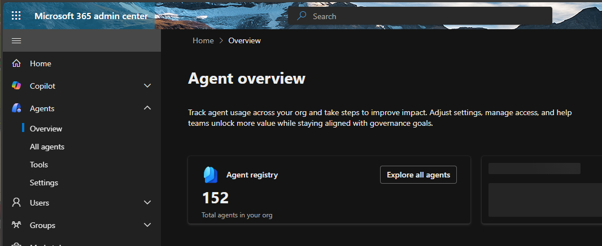
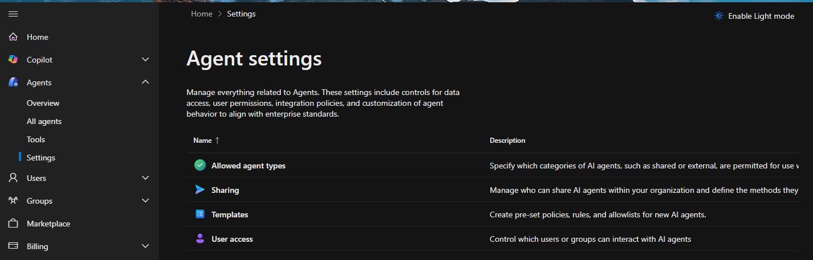

# Admin center

Tämä on koskien lyhyesti omassa henkilökohtaisessa **M365** admin center - järjestelmänvalvojan työkalua, jossa on erikseen oma tekoäly työkalu.

---

# Microsoft 365 -hallintakeskus 

> Nämä kuvat ovat tammikuu 2026 

Agent 365 yleiskatsaussivu toimii kaikkien agenttien ohjauskoneena. Sen avulla IT-järjestelmänvalvojat voivat käyttää keskitettyä koontinäyttöä:
- Seuraa edustajien käyttöönottoa ja käyttötrendejä.
- Tunnista hälytykset ja hallintopuutteet.
- Ota näkyvyys ja hallinta käyttöön vuokraajan kaikissa agentteihin.
  
Tätä voi tarkastella Agent 365 Yleiskatsaus -sivua siirtymällä Microsoft 365 -hallintakeskuskohtaan Agenttien>yleiskatsaus tai käyttämällä tekoälyn aloitussivun > Näkymää Agent 365 yleiskatsauksessa.

“Agents” Microsoft 365 Admin Centerissä ei ole mikään pieni lisävalikko, vaan osa uutta Agent 365-kokonaisuutta, joka toimii agenttien hallinnan ja valvonnan keskuksenakoko tenantissa.

 

## All agents 

Tässä “All agents” -välilehdessä Microsoft 365 Admin Centerissä näkyy agenttien hallintanäkymä, joka on osa uutta **Copilot ja Agent 365 -hallintakerrosta**. 

🧠 Mitä “All agents” -välilehti näyttää? “All agents” näyttää kaikki organisaatiossa rekisteröidyt ja käytössä olevat agentit, mukaan lukien: 

- Microsoftin omat agentit (esim. Sales-agentti)
- Kolmannen osapuolen agentit (esim. Asana, Egnyte, LawToolBox)
- Custom agentit, jos organisaatio on ladannut omia
- Agenttien metadata: nimi, julkaisija, kanavat, saatavuus, luontipäivä

Tämä ei ole pelkkä lista — se on hallintapaneeli agenttien elinkaaren, käytön ja valvonnan hallintaan.

## 📊 Agenttien metatiedot 

| Kenttä | Selitys | 
|----------------|-------------------------------------------------------------------------| 
| Name | Agentin nimi (esim. Sales, Asana) | 
| Publisher | Kuka on julkaissut agentin (Microsoft, External partners) | 
| Availability | Kenelle agentti on saatavilla (esim. All users) | 
| Channel | Missä agentti toimii: Copilot, Outlook, Teams, M365 | 
| Date created | Milloin agentti on otettu käyttöön tenantissa |

## 🛠 Ylävalikon toiminnot 

- **Refresh** – päivittää näkymän
- **Export to Excel** – vie agenttilistan Exceliin (auditointi, dokumentointi)
- **Upload custom agent** – lataa oma agentti (esim. GPT-pohjainen sisäinen työkalu)
- **Manage pinned agents** – hallitse, mitkä agentit näkyvät käyttäjille ensisijaisesti

## 🧑‍💼 Mitä tämä mahdollistaa adminille? 

1. Täysi näkyvyys agentteihin Näet, mitä agentteja on käytössä — myös ne, jotka ovat tulleet kolmansilta osapuolilta tai käyttäjien kautta.
2. Governance ja riskienhallinta Voit seurata, mitkä agentit ovat aktiivisia, milloin ne on otettu käyttöön, ja kuka ne on julkaissut.
3. Custom agenttien hallinta Voit ladata omia agentteja ja hallita niiden näkyvyyttä ja käyttöoikeuksia.
4. Käyttöpolitiikan toteutus Tämä toimii pohjana agenttien governance-politiikalle: mitkä agentit sallitaan, miten ne hyväksytään, ja kuka niitä saa käyttää.

## 💡 Miksi tämä on tärkeää asia?

Koska työskentelystä tietoturvaan, automaation ja politiikan parissa, tämä näkymä on: 

- **Auditointityökalu**: voidaan dokumentoida agenttien käytön ja alkuperän
- **Governance-paneeli**: voidaan toteuttaa käyttöoikeus- ja käyttöpolitiikat
- **Shadow AI -valvonta**: näkeä, mitkä agentit ovat ilmestyneet ilman virallista hyväksyntää
- **Käyttöoikeuksien hallinta**: voidaan rajata agenttien käyttöä roolien mukaan

 

 

---

# Mikä “Agents” oikeasti on?

“Agents” viittaa Microsoft Agent 365 -kokonaisuuteen, joka on Microsoftin uusi agenttien hallintataso (control plane) Microsoft 365 -ympäristössä.  
Kyseessä ei ole vain Copilotin valvonta, vaan kaikkien agenttien inventaario, hallinta, valtuutukset ja governance.

Faktat perustuvat Microsoftin dokumentaatioon.

---

## 🧠 Mitä hyötyä siitä on?

### 1) Täydellinen näkyvyys kaikkiin agentteihin

Agentit listataan:

- Microsoftin omat agentit (Copilot-, Teams-agentit, M365-agentit)
- Entra Agent ID:llä rekisteröidyt agentit
- Organisaation itse luomat agentit
- Shadow agents (agentit, jotka ovat ilmestyneet ilman virallista rekisteröintiä)

Kyseessä on ensimmäinen kerta, kun agenttien todellinen käyttö organisaatiossa voidaan nähdä.

---

### 2) Governance ja valvonta

Agenttien tilastot tarjotaan:

- Agenttien terveys- ja käyttötilastot (30 päivän snapshot)
- Käyttöasteet ja poikkeamat
- Riskien ja poikkeamien tunnistaminen
- “Top agents” -näkymä toimitetaan suoraan adminille

Kyseessä on jatkuva valvontakerros, joka toimii perus-overview’n sijaan.

---

### 3) Keskitetty pääsynhallinta

Seuraavat toiminnot voidaan toteuttaa:

- Agenttien luonti ja estäminen
- Sponsorin määrittäminen agenttien valvontaan
- Käyttäjien agenttipyynnöt voidaan hyväksyä tai hylätä (request/approval flow)
- Politiikkapohjat voidaan asettaa turvalliseen käyttöönottoon

Kyseessä on agenttien lifecycle management.

---

### 4) Agent Store

Agent Store on tulossa tai olemassa riippuen tenantista:

- Käyttäjien agenttipyynnöt voidaan tehdä suoraan Storesta
- Adminit voivat hyväksyä tai estää agentteja
- Omia agentteja voidaan julkaista organisaation sisäiseen käyttöön

---

### 5) Interoperability ja integraatiot

Agentit integroidaan seuraaviin:

- Microsoft 365 Admin Center
- Entraan
- Defenderiin
- Purview’hin

Agenttien identiteetti, oikeudet, tietoturva ja käyttödata voidaan hallita samoilla työkaluilla kuin muutkin resurssit.

---

## 🛠 Mitä konkreettisesti voidaan tehdä?

| Toiminto            | Mitä se tarkoittaa                                               |
|---------------------|------------------------------------------------------------------|
| Agent inventory     | Kaikki agentit tenantissa (myös shadow agents)                  |
| Access control      | Agenttien luonti-, käyttö- ja hallintaoikeudet voidaan määrittää |
| Approval workflows  | Käyttäjien agenttipyynnöt voidaan hyväksyä                       |
| Behavior monitoring | Agenttien toiminta ja riskit voidaan seurata                     |
| Policy templates    | Turvalliset asetukset voidaan vakioida käyttöönottoon           |
| Agent analytics     | Käyttö, trendit, hälytykset ja poikkeamat voidaan tarkastella    |
| Agent store         | Agenttien jakelu ja hallinta voidaan toteuttaa                   |

---

## 💡 Onko se vain valvontaa ja overview?

Ei. Kyseessä on agenttien täysi hallintakerros, joka sisältää:

- valvonnan  
- pääsynhallinnan  
- hyväksyntäprosessit  
- agenttien elinkaaren hallinnan  
- agenttien rekisteröinnin  
- agenttien turvallisuuspolitiikat  
- agenttien inventaarion  
- agenttien analytiikan  

Kyseessä on paljon enemmän kuin pelkkä “overview”.

---

## 🔐 Miksi tämä kerros on tärkeä?

Agent 365 tarjoaa kerroksen, jota organisaatiot ovat kaivanneet:

- Yksi paikka, jossa nähdään kaikki agentit — myös ne, joita ei tiedetty olevan olemassa  
- Yksi paikka, jossa hallitaan agenttien oikeuksia ja valvotaan niiden toimintaa  
- Yksi paikka, jossa agenttien governance-politiikat voidaan rakentaa  

Kyseessä on käytännössä “Shadow AI visibility + governance” Microsoftin toteuttamana.

---

