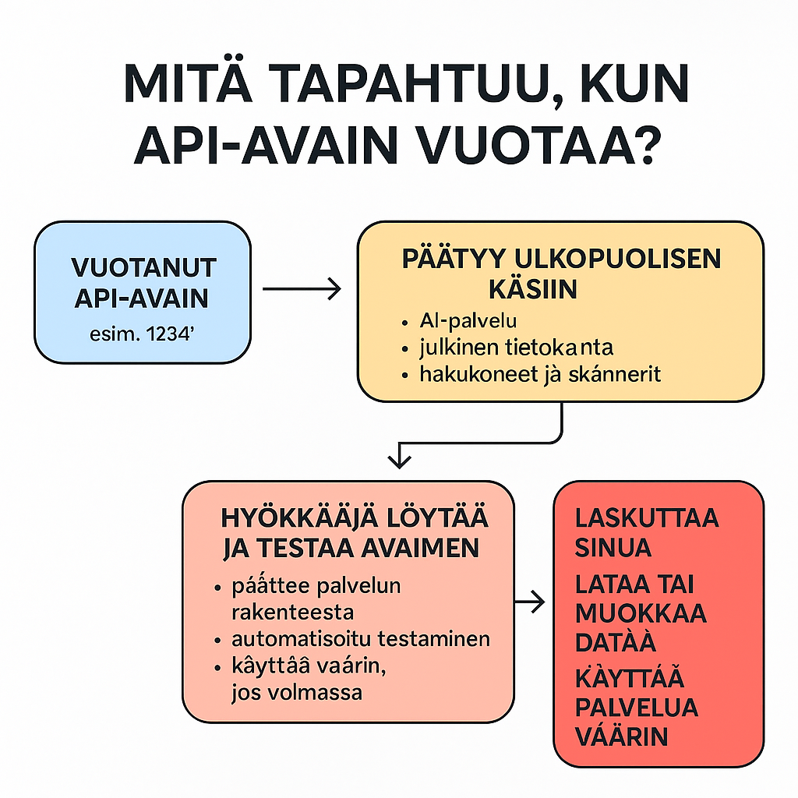

# Shadow AI – mitä tapahtuu, jos API-avain syötetään tekoälylle?

Tämä osio kuvaa simuloidusti, mitä voisi tapahtua, jos toimiva API-avain (esim. `1234-ABCD-SECRET`) syötetään ulkopuoliseen AI-palveluun. Kyseessä ei ole tekninen analyysi, vaan hahmottava riskipolku, joka auttaa ymmärtämään mahdollisia seurauksia.

---

## 1) Syöttöhetki

Käyttäjä liittää API-avaimen AI-chattiin, esimerkiksi:

```
API_KEY = "1234-ABCD-SECRET"
```
→ Tässä vaiheessa data poistuu käyttäjän hallinnasta.

## 2) Mihin API-avain voi päätyä?

Jos API-avain syötetään väärään paikkaan, se voi päätyä esimerkiksi:

**A) Palveluntarjoajan sisäisiin järjestelmiin**

- lokitietoihin  
- mallin sisäiseen kontekstiin  
- telemetriadataan  

**B) Kolmannen osapuolen palvelimille**

- selainlaajennusten kautta  
- automaattisten sovellusten kautta  
- epäluotettavien verkkosivujen kautta  

→ Tällöin avain voi päätyä suoraan hyökkääjän haltuun.

**C) Julkisiin tietokantoihin**

- GitHub  
- Pastebin  
- muut julkiset alustat  

→ Bottiverkot voivat kerätä avaimen minuuteissa.

**D) Skannereihin ja hakukoneisiin**

- Pastebin-skannerit  
- GitHub-skannerit  
- tekoälypohjaiset secret scanners  
- Shodan ja vastaavat työkalut  

---

## 3) Miten hyökkääjä voi tunnistaa avaimen?

Usein avaimen muoto paljastaa sen alkuperän:

- AWS: `AKIA...`  
- Stripe: `sk_live...`  
- OpenAI: `sk-...`  
- Google: `AIza...`  
- GitHub: `ghp_...`  

→ Palvelu voidaan tunnistaa pelkästä rakenteesta.  
→ Avainta voidaan testata automaattisesti.  
→ Avainta voidaan käyttää väärin, jos se on voimassa.

---

## 4) Mitä hyökkääjä voi tehdä vuotaneella avaimella?

Riippuen palvelusta, hyökkääjä voi:

**A) Laskuttaa käyttäjää**

- pilvipalveluissa (AWS, Azure, Google Cloud)  
- aiheuttaa tuhansien eurojen kustannuksia  

**B) Ladata tai muokata dataa**

- ERP-, CRM- tai automaatiojärjestelmissä  

**C) Käyttää palvelua väärin**

- lähettää sähköpostia  
- tehdä API-kutsuja  
- käyttää AI-resursseja  

**D) Varastaa dataa**

- päästä tietokantaan  
- lukea integraatioita  

---

## 5) Voiko avaimen sijaintia jäljittää?

Ei täysin.  
Kun avain on vuotanut, se voi olla:

- lokitiedoissa  
- mallin sisäisessä järjestelmässä  
- palveluntarjoajan infrastruktuurissa  
- julkisessa tietokannassa  
- bottiverkossa  
- hakukoneessa  
- Telegram-kanavassa  
- pimeässä verkossa  

→ Ainoa oikea toimenpide on poistaa avain ja luoda uusi.

---

## 6) Miten Shodan liittyy tähän?

Shodan ei kerää API-avaimia, mutta se:

- etsii avoimia palveluita  
- etsii avoimia portteja  
- etsii vanhoja konfiguraatioita  
- etsii IoT-laitteita  
- etsii haavoittuvuuksia  

→ Jos API-avain liittyy palveluun, joka on avoinna internetissä, Shodan voi paljastaa palvelun, ja hyökkääjä voi testata avaimen.

---

## 7) Mitä järjestelmänvalvoja voi tehdä?

**1️⃣ Rajoittaa oikeuksia**

- annetaan vain minimi-oikeudet  
- estetään pääsy kriittisiin resursseihin  

**2️⃣ Käyttää IP-rajausta**

- API toimii vain tietyistä IP-osoitteista  

**3️⃣ Käyttää lyhytaikaisia avaimia**

- avaimet vanhenevat automaattisesti  

**4️⃣ Käyttää salaisuudenhallintaa**

- Azure Key Vault  
- Google Secret Manager  
- HashiCorp Vault  

**5️⃣ Valvoa käyttöä**

- käyttöpäiväkirjat  
- anomalioiden tunnistus  

---

## 8) Yhteenveto

Jos API-avain vuotaa, sen sijaintia ei voida jäljittää täysin.  
→ Hyökkääjä voi tunnistaa avaimen, testata sen ja käyttää sitä väärin.  
→ Ainoa oikea toimenpide on poistaa avain, luoda uusi ja rajoittaa sen käyttöoikeuksia.

---
---

# Pieni malli skenaario



Tämä osio kuvaa lyhyesti, mitä tapahtuu tilanteessa, jossa käyttäjä, testaaja tai ohjelmistokehityksen parissa työskentelevä henkilö syöttää API‑avaimen tekoälyn chattiin. Tällainen toiminta muodostaa käytännössä Shadow AI ‑tilanteen, koska avain voi päätyä ympäristöihin, joita ei hallita.

> 📅 Kirjoitettu tammikuussa 2026. Sisältö voi päivittyä tai muuttua myöhemmin.

Lyhyesti tapahtumaketjusta: 
- Kun API‑avain syötetään tekoälyn chattiin, se voi päätyä ulkopuolisten nähtäväksi.
  - Tekoälypalveluihin jää yleensä lokitusta, ja avain voi tallentua tai vuotaa yhteyksien kautta.
- Hyökkääjien näkökulmasta avainta testataan automaattisesti eri ympäristöissä, ja sitä voidaan hyödyntää AI‑pentestauksessa tai muissa hyökkäysmenetelmissä.
  - Avaimen voimassaolo määrittää, kuinka pitkään sitä voidaan käyttää väärin.
  - Jos avain saadaan toimimaan, sitä voidaan käyttää kiristämiseen, phishing‑hyökkäyksiin tai laskutuksen väärinkäyttöön.
- Jos avain löytyy haavoittuvuusskannauksissa ja palveluntarjoaja (Azure, AWS, Google) tunnistaa sen omakseen, reagointi tapahtuu yleensä viiveellä.


---

# Mitä tapahtuu, kun API-avain vuotaa – käytännön skenaario ja reagointimallit

Tässä kuvataan, mitä todellisuudessa tapahtuu, kun API-avain vuotaa, miten pilvipalvelut reagoivat, mihin se voi päätyä ja miksi tekoäly ei voi olla vastuussa, vaikka se käsittelisi avainta.

---

## 1️⃣ Jos API-avain kuuluu Azureen, Googleen, AWS:ään tai muuhun pilvipalveluun — saavatko ne hälytyksen?

| Tilanne | Saako palveluntarjoaja hälytyksen? |
|--------|------------------------------------|
| Avain käytetään normaalisti | ❌ Ei |
| Avain käytetään poikkeuksellisesta IP-osoitteesta | ✅ Mahdollisesti |
| Avain käytetään poikkeuksellisesti (volyymi, malli) | ✅ Mahdollisesti |
| Avain käytetään palvelun ulkopuolelta, jota ei ole käytetty aiemmin | ✅ Mahdollisesti |
| Avain vuotaa julkisesti (GitHub, Pastebin) | ✅ Jos skanneri on käytössä |
| Avain käytetään bottien tai automaattisesti | ✅ Jos koneoppiminen on käytössä |

---

## 2️⃣ Voiko tekoäly olla vastuussa, jos se käsittelee salassapidettävää API-avainta?

❌ Tekoäly ei ole juridinen toimija.

- Tekoäly ei ole vastuussa mistään
- Tekoäly ei ole sopimusosapuoli
- Tekoäly ei ole rekisterinpitäjä tai NDA:n alainen
- Tekoäly ei tiedä, mitä se käsittelee
- Jos API-avain syötetään tekoälylle, se ei ymmärrä avaimen arvoa
- Tekoäly ei voi estää avaimen tallentumista
- Tekoäly ei voi estää avaimen päätymistä ulkopuolelle
- Tekoäly ei voi estää avaimen käyttöä Geminiin tai Copilotiin
- Tekoäly ei voi estää sen jakamista eteenpäin

---

## 3️⃣ Miten API-avain voi päätyä ulkopuoliseen käsin?

### Tyypillinen vuotopolku:

1. API-avain syötetään tekoälypalveluun (esim. *sk-1234…*)
2. Avain tallentuu sen kontekstiin tai lokiin
3. Palveluntarjoaja kerää telemetriaa tai analysoi sisältöä
4. Avain voi päätyä:
   - sisäiseen malliin
   - indeksoituun analytiikkaan
   - kehittäjän työkaluihin
5. Jos API-avain vuotaa tai my dataa → avain voi päätyä ulkopuolelle

### Hyökkääjän vuotopolku:

- Avain löytyy GitHubista, Pastebinistä, Telegramista
- Avain testataan automaattisesti
- Avain analysoidaan
- Avain käytetään väärin

7. Avain voi päätyä pimeään verkkoon (dark web)

---

## 4️⃣ Mitä tarkoittaa “dark web” tässä yhteydessä?

“Dark web” ei ole tietty paikka — se on:

- Tor-verkossa toimiva osa internetiä
- Ei indeksoitu hakukoneilla
- Sisältää foorumeita, tiedostoja ja kauppapaikkoja

### Tyypillisiä käyttötapoja:

- API-avainten myynti
- Tietovuotojen levittäminen
- Haavoittuvuuksien jakaminen
- Kiristysviestien levittäminen

Jos API-avain päätyy dark webiin:

- se voi olla ostettavissa
- se voi olla osana bottiverkkoa
- se voi olla osana phishing-työkaluja
- se voi olla käytössä hyökkäyksissä

---

## 5️⃣ Miten nopeasti palveluntarjoaja reagoi?

| Palvelu | Reagointinopeus | Kommentti |
|--------|------------------|-----------|
| Azure | ⏳ Viiveellinen | Sentinel voi havaita, mutta ei aina |
| Google Cloud | ⏳ Viiveellinen | DLP voi havaita, mutta ei automaattisesti |
| AWS | ⏳ Viiveellinen | Macie ja GuardDuty voivat havaita |
| GitHub | ✅ Reagoi | GitHub Secret Scanning toimii |
| OpenAI, Gemini, Copilot | ❌ Ei reagoi | Ei tiedetä, että avain on salainen |

Tutkimusten mukaan hyökkääjät voivat löytää ja käyttää vuotaneen API-avaimen jopa 60 sekunnissa — mutta pilvipalveluntarjoajien reagointi voi kestää tunteja. Azure, Google Cloud ja AWS havaitsevat hälytyksiä viiveellä ja konfiguraation mukaan.

---

## 🔄 Reagointinopeus: hyökkääjä vs. palveluntarjoaja

| Toimija | Reagointiaika | Kommentti |
|--------|----------------|-----------|
| Hyökkääjä (automaattinen skanneri) | ⏱ 60 sekunnista – 5 minuuttiin | GitHub, Pastebin, Docker Hub, Reddit jne. jatkuva seuranta |
| GitHub Secret Scanning | ✅ 1 minuutti | Erittäin nopea, mutta vaatii konfiguraation |
| AWS GuardDuty / Macie | ⏳ 5–30 minuuttia | Reagoi epäilyksiin, ei pelkkään avaimen vuotoon |
| Azure Sentinel / Defender | ⏳ 30–60 minuuttia | Reagoi telemetriaan, ei pelkkään avaimen vuotoon |
| Google Cloud DLP / SCC | ⏳ 30–60 minuuttia | Reagoi sisältöön, ei avaimen muotoon |
| Reagointi ilman valvontaa | ❌ Ei ollenkaan | Jos DLP/SOAR-puute, avain voi olla käytössä viikkoja |

---

## 🧠 Miten palveluntarjoaja voi havaita vuodon?

✅ Jos:

- avain käytetään poikkeuksellisesta IP-osoitteesta
- avain käytetään suurella volyymilla
- avain käytetään palvelun ulkopuolelta
- avain löytyy julkisesti (GitHub, Pastebin)

❌ Mutta ei, jos:

- avain käytetään normaalisti (esim. ChatGPT)
- avain syötetään tekoälylle, joka ei ymmärrä sen arvoa
- avain tallennetaan sisäisesti eikä konfiguroitu

---

## 🔥 Mikä on kriittistä?

- Hyökkääjät toimivat sekunneissa
- Palveluntarjoajan hälytys voi tulla minuuteissa–tunneissa, jos valvonta on päällä
- API-avaimen vuoto voi johtaa:
  - datan lataamiseen tai muokkaamiseen
  - laskutukseen tai resurssien väärinkäyttöön
  - kiristykseen tai phishingiin

---

## 🔐 GDPR ja juridinen vastuu?

- Tekoäly ei ole rekisterinpitäjä
- Käyttäjä toimii itse vastuullisesti
- Palveluntarjoaja voi reagoida, mutta ei aina
- Vastuu voi olla käyttäjällä, organisaatiolla tai kehittäjällä

---

## 🧩 Yhteenveto selkeästi

Jos API-avain syötetään tekoälylle, se voi tallentua ja automaattisesti testata sitä — ja tekoäly ei voi olla vastuussa. Vuoto voi johtaa laskutukseen, kiristykseen, väärinkäyttöön ja lopulta pimeään verkkoon. Ainoa tapa suojautua: ei syötetä avaimia hallitsemattomiin ympäristöihin.

---

# API-avaimen validointi, lokitus ja järjestelmän reagointi – tekninen rakenne 

Tässä kuvataan, mitä tapahtuu, kun API-avain syötetään järjestelmään, miten backend arvioi sen, mitä lokiin tallentuu ja miksi tekoäly ei tee päätöksiä tässä vaiheessa. Kyseessä on tekninen rakenne, joka toimii riippumatta siitä, onko avain oikea, virheellinen tai testikäytössä.


