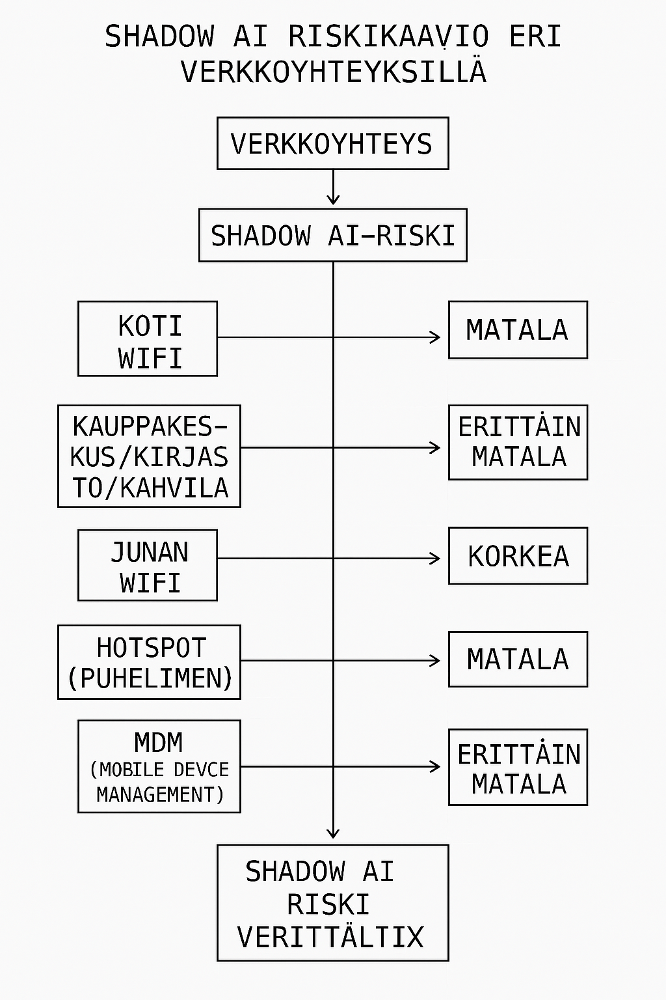

# Shadow AI – yhteydet, tietoliikenne ja mobiilivalvonta

Tässä osiossa käsitellään, miten VPN, RDP, hotspotit, Wi-Fi ja MDM liittyvät shadow AI ‑riskien hallintaan järjestelmänvalvojan ja IT-tuen näkökulmasta.

Yhteyksien kautta sovellukset, verkkosivustot ja palvelut saavat yhteyden internetiin, jolloin data pääsee liikkumaan — esimerkiksi viestien lähettämisessä, päivityksissä tai tiedonsiirrossa. Suurin haaste liittyy siihen, miten yhteys suojataan ja valvotaan: tapahtuuko datan siirto hallitusti vai syntyykö shadow AI ‑tilanne huomaamatta.

→ Shadow AI voi syntyä missä tahansa yhteydessä, jos tekninen valvonta puuttuu tai ohitetaan. Siksi yhteyksien hallinta on olennainen osa tietoturvaa ja AI-politiikkaa.

> Pieni mindmap kun tapahtuu Shadow AI yhteydessä - kun käyttäjä tarvii tekoäly chättin ja mahdolliset riskit. 

### 1) VPN (Virtual Private Network)

✅ VPN suojaa liikennettä, mutta ei estä shadow AI:ta.

- VPN salaa yhteyden, mikä on hyvä asia  
- Käyttäjä voi silti ohjata dataa AI-palveluun  
- VPN ei estä ChatGPT:n, Gemini:n tai Copilotin käyttöä  
- VPN ei estä, mitä käyttäjä kirjoittaa tai lähettää  

🔒 VPN = liikenteen suoja, ei sisällön valvonta  
→ Shadow AI voi tapahtua VPN:n kautta, jos muita valvontakeinoja ei ole käytössä.

---

### 2) RDP (Remote Desktop Protocol)

✅ RDP ei estä shadow AI:ta, mutta voi paljastaa sen.

- RDP-yhteys voi näyttää, mitä sovelluksia käytetään  
- RDP voi paljastaa, jos AI-chat avataan  
- RDP antaa näkyvyyttä käyttäjän toimintaan  

🔍 RDP = näkyvyys, ei estoa  
→ Shadow AI voidaan havaita, mutta ei estää pelkällä RDP:llä.

---

### 3) Hotspotit ja mobiiliverkot

❌ Suurin yksittäinen riskikohta.

Jos käyttäjä:

- käyttää puhelimen hotspotia  
- ohittaa yrityksen verkon  
- käyttää henkilökohtaista mobiilidataa  

→ Kaikki valvonta (proxy, DNS, DLP, CASB) ohitetaan.

⚠️ Hotspot = valvonnan ulkopuolinen reitti  
→ Shadow AI voi tapahtua täysin näkymättömästi.

🛡️ Estämiseksi tarvitaan:

- MDM (Mobile Device Management)  
- VPN-pakotus  
- DNS-tunnistus  
- käyttöpolitiikat  
- mobiililaitteiden hallinta  

---

### 4) Wi-Fi-verkot (yrityksen vs. julkinen)

❌ Julkinen Wi-Fi = sama riski kuin hotspot

- ei valvontaa  
- ei estoa  
- ei DLP:tä  
- ei CASB:tä  
- ei auditointia  

✅ Yrityksen Wi-Fi = valvottavissa

- proxy  
- DNS  
- palomuuri  
- segmentointi  
- tunnistus  

🔒 Wi-Fi = turvallinen vain, jos hallittu

---

### 5) MDM (Mobile Device Management)

✅ MDM = paras tapa hallita mobiililaitteita ja shadow AI ‑riskiä

MDM voi:

- estää AI-sovellusten asennuksen  
- estää henkilökohtaisten tietojen hallinnan  
- pakottaa VPN:n käyttöön  
- valvoa sovelluksia ja liikennettä  
- erottaa työ- ja henkilöprofiilit  
- estää datan kopioinnin AI-palveluihin  

✅ MDM = tekninen kontrolli, joka estää shadow AI:n mobiilissa

---

### 6) Yhteenveto selkeästi

| Yhteystyyppi        | Estää shadow AI:n? |
|---------------------|--------------------|
| VPN                 | ❌ Ei – suojaa liikennettä, ei sisältöä |
| RDP                 | ⚠️ Osittain – näkyvyys, ei estoa |
| Hotspot             | ❌ Ei – ohittaa kaiken valvonnan |
| Julkinen Wi-Fi      | ❌ Ei – sama riski kuin hotspot |
| Yrityksen Wi-Fi     | ✅ Kyllä – jos proxy/DNS/DLP käytössä |
| MDM                 | ✅ Kyllä – paras tapa hallita mobiilivarusteita |

🟦 Yksi lause, joka kiteyttää kaiken  
VPN, RDP ja Wi-Fi suojaavat yhteyttä, mutta vain MDM ja verkon valvonta voivat estää shadow AI:n syntymisen — erityisesti mobiililaitteissa ja hotspot-yhteyksissä.

---

# Shadow AI – Wi-Fi-verkot, hotspotit ja mobiiliverkkojen riskit

## 1) Kotiverkko

✅ Turvallinen, jos verkko on hallinnassa.

Kodin Wi-Fi on yleensä:

- salattu (WPA2/WPA3)  
- yksityinen  
- käytännön hallinnassa  
- VPN-yhteys käytössä (jos saatavilla)  

**Shadow AI -riski:**  
→ Normaali, ei erityisen korkea.

**Adminin ohjeistus:**

- VPN-yhteyttä suositellaan  
- AI-palveluihin ei tule syöttää työdataa  
- AI-tilejä ei tule käyttää ilman ohjeistusta  
- Vain yrityksen hyväksymiä AI-työkaluja tulee käyttää  

---

## 2) Yrityksen Wi-Fi

✅ Turvallisin vaihtoehto.

Yrityksen verkossa on:

- proxy  
- DNS-valvonta  
- DLP  
- CASB  
- domain-estot  
- lokitus  

**Shadow AI -riski:**  
→ Matala, koska valvonta toimii.

**Adminin ohjeistus:**

- AI-käyttö kulkee yrityksen valvonnan läpi  
- Henkilökohtaiset AI-tilit voidaan estää  
- Epäilyttävä käyttö voidaan havaita  

---

## 3) Julkiset Wi-Fi-verkot (kauppakeskus, kirjasto, kahvila)

❌ Erittäin riskialtis.

Julkisissa verkoissa:

- ei ole salasanaa tai se on heikko  
- liikenne voidaan kaapata  
- ei ole yrityksen valvontaa  
- ei ole DLP/CASB-suojauksia  
- ei ole DNS-estojärjestelmiä  

**Shadow AI -riski:**  
→ Korkea, koska:

- dataa voidaan syöttää AI-palveluihin ilman valvontaa  
- henkilökohtaisia AI-tilejä voidaan käyttää  
- arkaluontoisia tietoja voidaan käsitellä  
- MITM-hyökkäyksille altistutaan  

**Adminin ohjeistus:**

- Julkista Wi-Fiä ei tule käyttää ilman VPN:ää  
- Puhelimen hotspotia suositellaan  
- Luottamuksellista dataa ei tule käsitellä julkisessa verkossa  
- AI-palveluita ei tule käyttää julkisessa verkossa  

---

## 4) Junan Wi-Fi

❌ Sama riski kuin kahvilassa.

Junan Wi-Fi on:

- jaettu  
- valvomaton  
- usein salasanaton  
- ruuhkainen  
- altis hyökkäyksille  

**Shadow AI -riski:**  
→ Korkea, koska:

- yrityksen valvonta ei toimi  
- dataa voidaan syöttää AI-palveluihin ilman estoa  
- hyökkäysriski on korkea  

✅ Parempi vaihtoehto:  
→ Puhelimen hotspotin käyttö, koska:

- yhteys on yksityinen  
- yhteys on salattu  
- liikennettä ei jaeta muiden kanssa  
- MITM-hyökkäyksiltä voidaan suojautua  

---

## 5) Hotspot

✅ Paras vaihtoehto julkisissa paikoissa.

Hotspot on:

- yksityinen  
- salattu  
- käyttäjän hallinnassa  
- ei jaettu muiden kanssa  

**Shadow AI -riski:**  
→ Matala, mutta vain jos:

- VPN-yhteys on käytössä  
- työdataa ei syötetä henkilökohtaiseen AI-palveluun  

---

## 6) MDM (Mobile Device Management)

✅ MDM ratkaisee suurimman osan ongelmista.

MDM voi:

- pakottaa VPN:n käyttöön  
- estää AI-sovellusten asennuksen  
- estää henkilökohtaisten tilien käytön  
- estää datan kopioinnin AI-palveluihin  
- valvoa sovelluksia ja liikennettä  

**Shadow AI -riski:**  
→ Matala, jos MDM on käytössä ja konfiguroitu oikein.

---

## 7) Yhteenveto taulukkomuodossa

| Yhteysympäristö | Shadow AI -riski | Suositus |
|-----------------|------------------|----------|
| Kotiverkko      | Matala           | VPN + yrityksen AI |
| Yrityksen Wi-Fi | Erittäin matala  | Paras vaihtoehto |
| Julkinen Wi-Fi  | Korkea           | Käytä hotspotia |
| Junan Wi-Fi     | Korkea           | Käytä hotspotia |
| Hotspot         | Matala           | Paras julkisissa paikoissa |
| MDM             | Erittäin matala  | Pakollinen yrityksille |

---

## 8) Yksi lause, joka kiteyttää kaiken

Julkiset Wi-Fi-verkot ja junien verkot ovat suurin riski shadow AI:lle — hotspotin ja VPN:n käyttöä suositellaan, ja järjestelmänvalvojan tehtävänä on ohjeistaa selkeästi, mitä AI-palveluita saa käyttää missäkin verkossa.

> Sama pätee kaikkiin julkisiin liikenneympäristöihin, kuten lentoasemille, juniin, laivoihin ja muihin vastaaviin paikkoihin. Näissä verkoissa voi olla kymmeniä tai satoja käyttäjiä samanaikaisesti, jolloin riski kasvaa merkittävästi. Hyökkääjä voi esimerkiksi teeskennellä tarjoavansa ilmaista Wi-Fi-yhteyttä ja toteuttaa man-in-the-middle (MITM) ‑hyökkäyksen, jossa käyttäjän liikennettä tarkkaillaan ja ohjataan. Tällöin voidaan esimerkiksi kaapata sähköpostiyhteys tai syöttää dataa AI-palveluun käyttäjän puolesta — syntyy shadow AI ‑tilanne, joka kulkee mutkan kautta ja yhdistää useita hyökkäystekniikoita. Lyhyesti sanottuna: hyökkäyskeinoja on paljon, ja ne kehittyvät jatkuvasti.

> Sama pätee myös hotellien Wi-Fi-verkkoihin, vaikka verkon nimi ja kertakäyttöinen salasana annetaan vastaanotosta. Kyseessä on silti julkinen ympäristö, jossa verkkoa käyttää suuri määrä vieraita ja työmatkailijoita. Tällaisissa verkoissa ei voida tietää, kuka on yhteyden toisessa päässä tai mitä laitteita verkossa on. Hyökkääjä voi esimerkiksi luoda oman tukiaseman hotellin verkon nimellä ja toteuttaa man-in-the-middle (MITM) ‑hyökkäyksen, jossa käyttäjän liikennettä tarkkaillaan tai ohjataan. Tällöin voidaan kaapata sähköpostiyhteyksiä, ohjata liikennettä vääriin palveluihin tai jopa aiheuttaa shadow AI ‑tilanteita käyttäjän huomaamatta. Lyhyesti sanottuna: julkisissa verkoissa hyökkäyskeinoja on paljon, ja ne kehittyvät jatkuvasti.

---

## 10) Shadow AI, nettiyhteys ja IoT-laitteet

### 1) Tapahtuuko shadow AI vain, jos on nettiyhteys?

🟩 Kyllä — lähes aina.

Shadow AI syntyy vain, jos data:

- lähetetään ulkopuoliseen palveluun  
- kulkee internetin yli  
- päätyy palveluntarjoajan malliin  
- tallentuu lokitietoihin  
- voi päätyä mallin koulutukseen  

→ Ilman nettiyhteyttä ei synny shadow AI:ta, koska data ei poistu laitteesta.

**Poikkeus:**  
Jos käytössä on offline-AI-malli, kuten:

- paikallinen LLM  
- suljettu edge-malli  
- yrityksen sisäinen offline-malli  

→ Shadow AI:ta ei synny, koska data ei lähde ulos.

---

### 2) Entä IoT-laitteet?

🟥 IoT-laitteet ovat lähes aina yhteydessä internetiin.

Esimerkkejä:

- älylukot  
- kamerat  
- sensorit  
- logistiikkalaitteet  
- tuotantolaitteet  
- älyvalot  
- älypistorasiat  

Nämä laitteet:

- lähettävät dataa pilveen  
- käyttävät API-rajapintoja  
- tekevät automaattisia POST-pyyntöjä  
- voivat sisältää haavoittuvuuksia  
- voivat vuotaa dataa ilman käyttäjän huomiota  

🟥 IoT + AI = uusi riskikerros

Jos IoT-dataa syötetään AI-palveluun (esim. analysointia varten), syntyy:

- tietovuoto  
- shadow AI  
- mahdollinen turvallisuusriski  
- mahdollinen toimitusketjuriski  

**Esimerkkejä:**

- varaston robotin lokit → ChatGPT Free  
- kameran kuvat → Gemini Free  
- sensoridata → Copilot Free  

→ Tämä muodostaa suoran shadow AI ‑tilanteen.

---

### 3) Entä haavoittuvuudet?

IoT-laitteet ovat tunnetusti:

- huonosti päivitettyjä  
- huonosti suojattuja  
- ilman salattua liikennettä  
- ilman lokitusta  

→ Tämä tarkoittaa:

🟥 IoT-laitteet voivat vuotaa dataa ilman AI:ta

Esimerkiksi:

- kamerat voivat lähettää kuvia ulkopuolelle  
- sensorit voivat lähettää dataa valmistajan pilveen  
- älylukot voivat lähettää lokitietoja  

→ Shadow AI ei ole mukana, mutta data silti vuotaa.

🟥 IoT-laitteet voivat vuotaa dataa AI:n kautta

Jos IoT-dataa syötetään AI-palveluun, syntyy:

- shadow AI  
- tietovuoto  
- mahdollinen sopimusrikkomus  
- mahdollinen GDPR-rikkomus  

---

### 4) Yhteenveto selkeästi

| Ilmiö | Riski | Selitys |
|-------|------|---------|
| Shadow AI | 🟩 Vaatii nettiyhteyden | Ilman internetiä data ei siirry AI-palveluun |
| IoT-laitteet | 🟥 Riskialttiita | Lähes aina verkossa, voivat vuotaa dataa |
| IoT + AI | 🟥 Korkea riskitaso | AI-palveluun syötetty IoT-data muodostaa shadow AI:n |
| Offline-AI | 🟦 Turvallisin | Paikallinen malli ei siirrä dataa ulos |

🟦 Yksi lause, joka kiteyttää kaiken  
Shadow AI syntyy vain, kun data lähtee internetin yli — ja IoT-laitteet ovat erityisen riskialttiita, koska ne ovat lähes aina verkossa ja voivat vuotaa dataa huomaamatta.
