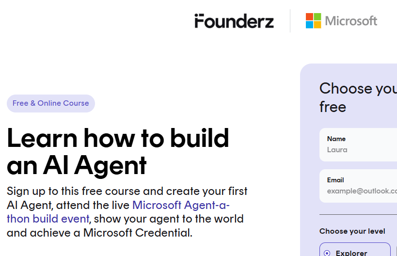
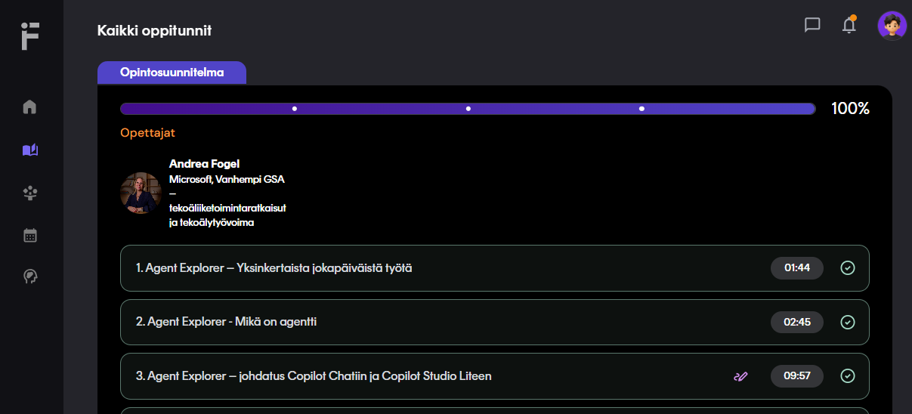

# Founderz - Agent explorer

https://founderz.com/skilling/agent-a-thon-fz/sign-up/

m365 & copilot chat

keskittymisen palautuminen 23min siihen pisteesen mitä oli tekemässä - joku tutkimus

deklaraativinen agentti

- no code
- no additional license cost
- designed to reduce interruptions, offload repetitive tasks and free up time for deeper, creative work

> ilmoittautumisen etusivu: https://founderz.com/skilling/agent-a-thon-fz/sign-up/

## mikä agentti

> Kurssin sisältö ja sisällä, esim. suoritettu 100%

agenti versus perinteinen chatti

- agentti on kohdennettu digitaalinen apuri, joka hoitaa yhden asian hyvin - vasta kyssäriin ja/tai ohjaa vaiheita vaiheelta antamien ihmisten ohjeiden perusteella

copilot studio lite
- agentti on tietyynt arkoitukseen tehty digitaalinen assistentti, joka toimii suoraan copilot chatin sisällä

agent = answers + take actions in your network envinroment

mikä on deklaraativinen agentti
- deklaraativinen agentti rakennetaan kertomalla tai "deklaroimalla" copilotille selkeästi, mitä agentin tulee tehdä ja miten se tulee käyttäytyä.

copilot studio lite - on saatavilal copilot chat käyttäjille, ilman täyttä copilot lisenssiä määrittelemällä kolme osa-aluetta

declarative agent
- instructions
- public web knowledge
- built-in capabilities (enhance with reasoning tools) -> copilot studio lite's python code interpreter (voi tehdä laskelmia, analysoida tietoja tai luoda visualisoida image)

copilot lisenssi - lisätä ominaisuuksia (full m365 copilot license features)
- connecting to your internal enterprise data
- using sharepoint or file-based knowledge
- enabling advanced workflows and automation

deklaraativinen agentti noudattavat automaattisesti microsoft tietoturva- ja vaatimustenmukaisuustandardeja - sama kuin koskevat m365 ympäristöä.

MS graph actions toimintoja ja integraatiota laajan joukkon liiketoimintajärjestelmiä.

## johdatus copilot chatiin ja copilot studio liteen

kaikki tapahtuu Microsoft 365 copilot soveluksessa

access points to cpilot chat and copilot studio lite

- microsoft365.com/chat
- office.com/chat
- teams (via the copilot app)

toimivana mini-help desk 24/7

- where do i find the vacation policy
- how do i request equipment
- what's our onboarding checklist

Copilot käyttää GPT-5

ei yksi malli vaan useampi 

Licensing guideline:
- Julkinen sisältö on maksuton (public content -> free)
- sisäinen yrityssisältö on mitattavaa (internal, company content -> metered)

> Copilot studio lite noudattaa samoja tietotuirva- ja compliance sääntöjä kuin muu M365
> (huom tämä on vain yritys tilille että pitää olla tenant olemassa , sekä ei pysty henkilökohtaisena outlook/hotmail.com tarjota) paitsi ellei kulje muun kautta avatessaan tenant.
> eli henkilökohtaisessa tilissä ei pysty, ja vaikka oiskin azure tenant niin siinä vaattii sen minimiaalsen lisenssin käyttön

> Tämä on omasta admin centeristä, että miltä se näyttää ennen kun saa aktivoitua lisenssin. Tätä pitää saada ensin lisenssin käyttöön ennen kuin alkaa ottaa käyttöönsä

# linkit
https://learn.microsoft.com/en-us/microsoft-365/copilot/extensibility/declarative-agent-instructions

