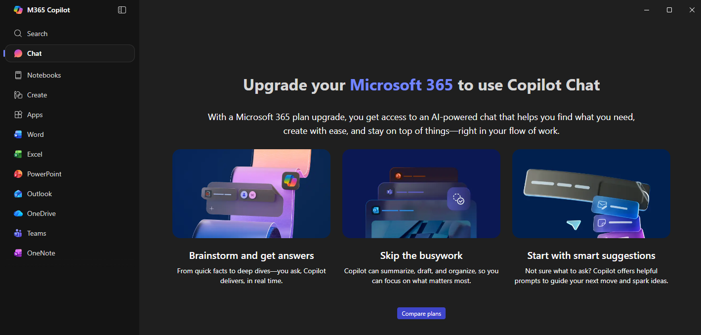

Tämä on muistiinpano koskien "Microsoft 365 Copilot Chat" (toukokuu 2026)

OHJE: https://learn.microsoft.com/en-us/copilot/overview

Copilot Chatissa on agentti‑kenttä, jota Microsoft kutsuu nimellä Agents (ent. plugins). Nämä agentit voivat olla:

• Declarative agents → ilmaisia, toimivat julkisen webin ja ohjeiden pohjalta, eivät käytä tenant‑dataa  
• Advanced agents → käyttävät SharePointia, Graph‑dataa, liitettyjä tietolähteitä jne., vaativat lisensoinnin ja Copilot Studion meteringin  

Lähde: Microsoft Learn kertoo, että declarative‑agentit ovat ilmaisia ja käytettävissä Copilot Chatissa ilman lisenssiä, mutta Graph‑pohjaiset agentit vaativat Copilot Studion ja meteringin 

Henkilökohtaisessa tilissä tätä ei ole saatavilla, että vain yritystilien tenanti tai toimivana tenant tyyppisenä on mahdollista tarjota.
 
Tarvitaanko erillinen lisenssi?  
Copilot Chat (Basic) = ei vaadi erillistä lisenssiä, jos sinulla on jokin seuraavista työ-/koululisensseistä:  
	• Microsoft 365 Business Basic / Standard / Premium  
	• Microsoft 365 E3 / E5  
	• Microsoft 365 F1 / F3  
	• Office 365 E1 / E3 / E5  
	• Teams Essentials / Enterprise …ja paljon muita (lista on pitkä)  
	

access points to cpilot chat and copilot studio lite
 
• microsoft365.com/chat  
• office.com/chat  
• teams (via the copilot app)  

Sekä tukee ton Windows työaseman "Microsoft 365 Copilot" - sama ideas kuin integroidakseen voi käyttää työaseman sovellsuta tai selain versiota, tai jopa puhelinta - että riippumatta missä käyttää tätä chättiä.

"Copilot chat" versus "Microsoft M365 copilot"

Selainkäyttö on vähän sekava nykyään, koska Microsoft tarjoaa myös ilmaista/pohjatason “Copilot Chat” -versiota tietyillä M365-tileillä ilman täyttä Copilot-lisenssiä. Mutta se ei anna kaikkia työpöytäsovellusten premium-toimintoja. 

Copilot Chat ja Microsoft 365 Copilot näyttävät ensisilmäyksellä samalta tuotteelta, koska molemmissa käytetään Copilot-nimeä ja molemmat hyödyntävät tekoälyä. Käytännössä ne ovat kuitenkin eri tarkoitukseen suunniteltuja palveluita.

Copilot Chat on periaatteessa tekoälychat samalla idealla kuin ChatGPT. Sitä käytetään yleensä selaimessa tai kevyesti Microsoftin palveluiden yhteydessä. Sen tarkoitus on auttaa kirjoittamisessa, kysymyksiin vastaamisessa, tekstien tiivistämisessä ja yleisessä ideoinnissa. Se toimii enemmän henkilökohtaisena avustajana eikä tarvitse syvää yhteyttä yrityksen sisäisiin tietoihin. Tämän vuoksi Copilot Chat voi toimia myös henkilökohtaisella Microsoft-tilillä ilman raskasta yritysinfrastruktuuria.

Copilot Chat
	• selain/chat-käyttö 
	• kevyt AI-avustaja 
	• usein mukana ilman erillistä Copilot-maksua 
	• toimii M365-tilillä rajatummin 

TÄMÄ ON HENKILÖKOHTAINEN NÄKYMÄNSÄ - siis Microsoft m365 copilot sovellus:
- Periaatteessa tässäkin on mahdollista tarjota se sovellus, mutta erikseen pitää ostaa tietenkin lisenssi ja palvelu esim. Kuukausi/vuosi lisenssi.

Copilot Chatin tärkeimmät ominaisuudet ovat:
	• toimii myös henkilökohtaisella Microsoft-tilillä 
	• käytetään pääasiassa selaimessa tai chat-käyttöliittymässä 
	• tarkoitettu yleiseen tekoälykäyttöön 
	• ei ole syvästi integroituna yrityksen Microsoft 365 -dataan 
	• kevyempi ja usein osittain ilmainen palvelu 
	
Microsoft 365 Copilot on puolestaan paljon laajempi kokonaisuus. Se ei ole pelkkä keskustelubotti, vaan tekoäly, joka integroidaan yrityksen Microsoft 365 -ympäristöön. Se yhdistyy esimerkiksi Outlookiin, Wordiin, Exceliin, Teamsiin, SharePointiin ja OneDriveen. Tämän ansiosta se pystyy hyödyntämään organisaation omia tiedostoja, sähköposteja, kokouksia ja dokumentteja.
Kun käyttäjä pyytää esimerkiksi tekemään raportin viime kuukauden Teams-kokousten ja SharePoint-dokumenttien perusteella, Microsoft 365 Copilot käyttää yrityksen Microsoft Graph -dataa hakeakseen oikeat tiedot. Samalla sen täytyy noudattaa käyttöoikeuksia, tietoturvakäytäntöjä ja compliance-sääntöjä. Copilot ei siis saa nähdä mitään sellaista materiaalia, johon käyttäjällä ei muutenkaan olisi pääsyä.

Microsoft 365 Copilotin tärkeimmät ominaisuudet ovat:
	• toimii vain työ- tai koulutilillä 
	• integroituna Wordiin, Exceliin, Outlookiin ja Teamsiin 
	• käyttää yrityksen Microsoft Graph -dataa 
	• hyödyntää SharePointin, OneDriven ja sähköpostien sisältöä 
	• vaatii yrityksen tenant-ympäristön ja käyttäjähallinnan 
	• tarvitsee erillisen Copilot-lisenssin käyttäjälle 
	
Suurin ero palveluiden välillä on siinä, että Copilot Chat toimii yleisenä tekoälychatina, kun taas Microsoft 365 Copilot toimii yrityksen omalla datalla ja Microsoft 365 -ympäristön sisällä. Tämän vuoksi Microsoft 365 Copilot tarvitsee enemmän tietoturvaa, käyttöoikeuksien hallintaa ja erillisen lisensoinnin.
Yrityksellä täytyy yleensä olla ensin pohjalisenssi, kuten Microsoft 365 E3, E5 tai Business Premium, jonka jälkeen käyttäjälle voidaan lisätä Microsoft 365 Copilot -lisenssi. Ilman tätä lisenssiä käyttäjä voi usein käyttää kevyempää Copilot Chat -versiota, mutta ei täysiä Office-sovelluksiin integroituja tekoälytoimintoja.
Yksinkertaistettuna Copilot Chat on yleinen tekoälychat, kun taas Microsoft 365 Copilot on yrityksen omaan Microsoft-ympäristöön sidottu tekoälyavustaja, joka osaa käyttää organisaation dataa turvallisesti ja hallitusti.

