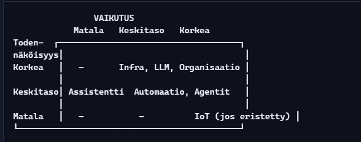

# 🔷 Käyttö- ja sovellusympäristöt agenttien ja assistenttien näkökulmasta

Tässä osiossa kuvataan, missä ympäristöissä agentteja ja assistentteja käytetään tai tullaan käyttämään. Mukana ovat nykyiset työkalut, tulevaisuuden ominaisuudet ja yhteiset nimittäjät, jotka yhdistävät eri sovellusalueet.

> Huomoithan tämä on kirjoitettu tammikuu 2026 - että sisältö ja teksti saattaa muuttua ja tieto päivittyä myöhemmin.

---

## 🏭 1. Teollisuus: robottikädet, logistiikkarobotit, tuotantoautomaatio

### Robotiikka / robot arm
- Hitsausrobotti  
- Maalausrobotti  
- Kokoonpanorobotti  

### Logistiikkarobotit (AGV, AMR)
- Kuljetus  
- Hyllytys  
- Keräily  

### RPA (Robotic Process Automation)
- Ohjelmistorobotiikka  
- Tuotannon ja tietotyön automaatio  

---

## 🧑‍💼 2. Toimistotyö: sihteeri, tuntikirjaus, dokumentointi

### Tekoälysovellukset työpöydällä
- Kalenterin hallinta  
- Tuntikirjaus  
- Dokumentointi  

### Tekoälyagentti toimistossa
- Sihteeri  
- Avustaja  
- Muistuttaja  
- Tiedonhakija  

---

## 📱 3. Mobiili: mitä tapahtuu puhelimessa?

### Älypuhelin
- Puheentunnistus  
- Tekoäly  
- Generatiivinen tekoäly  

### Autettu mobiilikäyttö
- Tekoälyagentti puhelimessa  
- Tekoälyagentti puhelimen kautta muissa ympäristöissä  

### Agentti mobiilissa (itsenäinen toiminta)
- Kalenterin hallinta  
- Tuntikirjaus  
- Dokumentointi  
- Tiedonhaku  
- Muistuttaminen  
- Viestintä  
- Puhelut  
- Sähköposti  
- Kuvien käsittely  
- Kuvien ottaminen  
- Kuvien lähettäminen  
- Kuvien etsiminen  
- Kuvien tulkinta  
- Kuvien käyttö muissa ympäristöissä  

---

## 🌍 4. Muut vastaavat ympäristöt

### Fyysiset ympäristöt
- Kuljetuslaitteet  
- Kuluttajalaitteet  
- Kodinkoneet  

### Organisaatiot
- HR  
- Talous  
- Asiakaspalvelu  
- Hallinto  

---

## 🧠 5. Yhteinen nimittäjä kaikille näille

Kaikki nämä ympäristöt liittyvät:

- Nykyisiin laitteisiin ja järjestelmiin  
- Tulevaisuuden laitteisiin ja järjestelmiin  
- Tekoälyyn  
- Automaatioon  
- Robotiikkaan  
- Agentteihin  
- Oppiviin järjestelmiin  
- Jatkuvasti käytössä oleviin järjestelmiin  

---

## 🧭 6. Mihin tämä on menossa?

- Asenteet → hyväksyntä  
- Agentit → lisääntynyt käyttö  
- Robotiikka → fyysiset tai ohjelmalliset kädet  
- RPA → laajenee työpöydälle  
- Mobiliteetti → jatkuva käyttöympäristö  

---

# II. Ympäristöt

## 🚗 1. Ajoneuvot

### Nykyiset työkalut ja esimerkit
- Navigointi  
- Ajotietokone  
- Nopeuden säätö  
- Kaistavahti  
- Hätäjarrutus  
- Automaattinen pysäköinti  
- Autonominen ajaminen  

### Tulevaisuuden ominaisuuksia
- Täysin autonominen  
- Tekoälyavusteinen  
- Oppiva  
- Agentti mukana  

---

## 🧍‍♂️ 2. Kuluttajalaitteet (IoT, älykoti, puettavat laitteet)

### Nykyiset työkalut ja esimerkit
- Älykello  
- Älypuhelin  
- Älytelevisio  
- Älykaiutin  
- Älyvalot  
- Älylukko  
- Älyjääkaappi  
- Älyuuni  
- Älypeili  

### Tulevaisuuden ominaisuuksia
- Täysin autonominen  
- Tekoälyavusteinen  
- Oppiva  
- Agentti mukana  

---

## 🚚 3. Logistiikka ja koneet

### Nykyiset työkalut ja esimerkit
- Navigointi  
- Ajotietokone  
- Nopeuden säätö  
- Kaistavahti  
- Hätäjarrutus  
- Automaattinen pysäköinti  
- Autonominen ajaminen  

### Tulevaisuuden ominaisuuksia
- Täysin autonominen  
- Tekoälyavusteinen  
- Oppiva  
- Agentti mukana  

---

## 🛡️ 4. Turvajärjestelmät

### Nykyiset työkalut ja esimerkit
- Kameravalvonta  
- Liikkeentunnistus  
- Kasvojentunnistus  
- Hälytysjärjestelmät  

### Tulevaisuuden ominaisuuksia
- Täysin autonominen  
- Tekoälyavusteinen  
- Oppiva  
- Agentti mukana  

---

## 🏢 5. Organisaatiot (HR, talous, asiakaspalvelu, hallinto)

### Nykyiset työkalut ja esimerkit
- HR-järjestelmät  
- Taloushallinto  
- Asiakaspalvelujärjestelmät  
- Hallintojärjestelmät  

### Tulevaisuuden ominaisuuksia
- Täysin autonominen  
- Tekoälyavusteinen  
- Oppiva  
- Agentti mukana  

---

## 🧑‍💻 6. Päivittäiset ja tulevaisuuden työkalut (mobiili, arki, työpöytä)

### Nykyiset työkalut ja esimerkit
- Kalenterin hallinta  
- Tuntikirjaus  
- Dokumentointi  
- Tiedonhaku  
- Muistuttaminen  
- Viestintä  
- Puhelut  
- Sähköposti  
- Kuvien käsittely  
- Kuvien ottaminen  
- Kuvien lähettäminen  
- Kuvien etsiminen  
- Kuvien tulkinta  
- Kuvien käyttö muissa ympäristöissä  

### Tulevaisuuden ominaisuuksia
- Täysin autonominen  
- Tekoälyavusteinen  
- Oppiva  
- Agentti mukana  

---

## 🧭 7. Muut alueet (laajeneva sovellusalue)

- Koulutus  
- Terveys  
- Rakentaminen  
- Maatalous  
  - Kasvintuotanto  
  - Eläintuotanto  
  - Maatalouden koneet ja laitteet  
  - Prosessit ja järjestelmät  
  - Organisaatiot ja hallinto  
  - Koulutus ja tutkimus  
  - Logistiikka ja jakelu  
  - Tuotteiden jalostus  
  - Tuotteiden myynti  
  - Tuotteiden kulutus  
  - Tuotteiden kierrätys  
  - Tuotteiden uusiokäyttö  
  - Tuotteiden hävittäminen  

---

# 🔷 Yhteenveto

Agentit ja assistentit ovat laajasti sovellettavissa eri ympäristöissä. Niiden rooli vaihtelee teknisestä avustajasta autonomiseen päätöksentekijään. Käyttöympäristöjen ymmärtäminen on keskeistä, kun suunnitellaan agenttien käyttöönottoa, riskienhallintaa ja EU AI Actin mukaista dokumentaatiota.

---

---

# 🔷 Riskikartta – automaatio, tekoäly, agentit ja assistentit -ekosysteemi

Tässä osiossa kuvataan keskeiset riskit, jotka liittyvät automaation, tekoälyn, agenttien ja assistenttien käyttöön eri ympäristöissä. Riskit on jaoteltu yksittäisiin, yhdistelmä-, infrastruktuuri-, bugi-, fyysisiin ja hallintamallin riskeihin.

---

## 🔷 Kerroksellinen riskitaulukko – taso, todennäköisyys, vaikutus ja riskityypit

| Kerros | Riskitaso | Todennäköisyys | Vaikutus | Riskityypit |
|--------|-----------|----------------|----------|-------------|
| **1. Fyysinen kerros** (IoT, robotit, autot) | 🔴 Korkea | 🟠 Keskitaso | 🔴 Korkea | Sensorivirheet, mekaaniset viat, ylikuumeneminen, sähkökatkot, turvallisuusviat, törmäykset |
| **2. Verkko- ja infrakerros** | 🟠 Keskitaso | 🔴 Korkea | 🟠 Keskitaso | Nettiyhteyden katkot, DNS-virheet, palvelinhäiriöt, yhteyksien epäonnistuminen, muistin loppuminen, varavoiman puute |
| **3. Automaatio- ja prosessikerros** (RPA, CI/CD) | 🟠 Keskitaso | 🟠 Keskitaso | 🔴 Korkea | Väärä prosessi, jumiutuminen, ajoitusvirheet, konfiguraatiovirheet, ei fallback-tilaa, virheellinen integraatio |
| **4. Tekoälykerros** (LLM, päätöksenteko) | 🟠 Keskitaso | 🔴 Korkea | 🟠 Keskitaso | Hallusinaatiot, väärinymmärrykset, puutteellinen data, epäselvät rajaukset, mallipäivitysten muutokset |
| **5. Agenttikerros** (autonomiset toiminnot) | 🔴 Korkea | 🟠 Keskitaso | 🔴 Korkea | Väärä toimintaketju, liiallinen autonomia, loopit, tilanhallinnan menetys, heikot rajat, puutteellinen valvonta |
| **6. Assistenttikerros** (käyttöliittymä, työkalut) | 🟢 Matala | 🟠 Keskitaso | 🟠 Keskitaso | Väärin tulkittu komento, väärä työkalun käyttö, käyttäjän virheet, konfiguraatiovirheet |
| **7. Organisaatiokerros** (politiikat, roolit, valvonta) | 🔴 Korkea | 🔴 Korkea | 🔴 Korkea | Puutteelliset politiikat, liian laajat oikeudet, shadow AI -riskit, valvonnan puute, dokumentoinnin puute |

---

## 🔷 Mitä kerroksellinen riskikartta kertoo?

Tässä osiossa kuvataan, miten riskit muodostuvat eri teknologisissa ja organisatorisissa kerroksissa, ja miten ne voivat aiheuttaa ketjureaktioita järjestelmän sisällä.

### 1. Riskit syntyvät kerrosten välisistä riippuvuuksista

- IoT → agentti → automaatio → pilvi → assistentti → käyttäjä  
- Jokainen linkki voi aiheuttaa ketjureaktion  

### 2. Fyysiset riskit ovat alimmalla tasolla

- Robotit  
- Autot  
- IoT-laitteet  
- Turvalaitteet  

### 3. Tekoäly- ja agenttiriskit ovat keskikerroksissa

- Päätöksenteko  
- Autonomia  
- Toimintaketjut  

### 4. Organisaatioriskit ovat ylimmällä tasolla

- Politiikat  
- Valvonta  
- Oikeudet  
- Koulutus  

### 5. Sähkö, netti ja päivitykset ovat kaikkia kerroksia koskevia riskejä

- Nämä infrastruktuuririskit voivat vaikuttaa kaikkiin kerroksiin samanaikaisesti  
- Ne voivat laukaista tai pahentaa muita riskejä eri tasoilla  

---

# 📊 Riskimatriisi (todennäköisyys × vaikutus)

---

## 🔷 Mitä tämä malli kertoo?

Tässä osiossa kuvataan, mitkä kerrokset muodostavat suurimman riskin, kun tarkastellaan riskitasoa, todennäköisyyttä ja vaikutusta samanaikaisesti.

### Korkean riskin kerrokset

- Fyysinen kerros  
- Agenttikerros  
- Organisaatiokerros  

### Korkean todennäköisyyden riskit

- Verkkoinfra  
- Tekoälykerros  
- Organisaatiokerros  

### Korkean vaikutuksen riskit

- Fyysiset laitteet  
- Agentit  
- Automaatio  
- Organisaatiot  

---

### 🔍 Yhteenveto

Fyysiset laitteet + autonomia + heikko governance = suurin mahdollinen riski.

Tämä tarkoittaa, että kun fyysiset järjestelmät (kuten IoT-laitteet tai robotit) yhdistetään autonomisiin toimintoihin (agentit) ilman selkeää valvontaa, politiikkaa ja dokumentaatiota (organisaatiokerros), syntyy järjestelmän kannalta kriittisin riskikokonaisuus.

