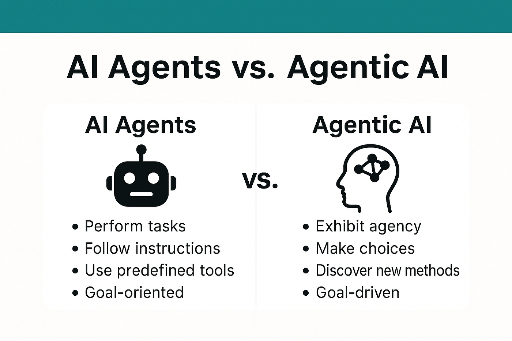

# Tekoälyjen agentit ja assistentit

# 🔷 Agentit ja assistentit – määrittely, riskit ja velvoitteet

Tässä osiossa kuvataan, mitä tarkoitetaan tekoälyagenteilla ja assistenteilla, miten ne eroavat toisistaan, ja mitä velvoitteita niihin liittyy EU AI Actin, GDPR:n ja ISO 27001:n näkökulmasta.

---

## 🔁 Kertaus: agentti vs. assistentti

- **Assistentti** toimii vuorovaikutteisesti, vastaa käyttäjän pyyntöihin ja toimii ohjeiden mukaan.  
  → Esimerkkejä: Copilot, ChatGPT, Midjourney, sisäinen chatbot

- **Agentti** toimii autonomisesti, suorittaa tehtäviä, ketjuttaa toimintoja ja käyttää työkaluja tai rajapintoja.  
  → Esimerkkejä: automaattinen varausagentti, API-käyttöön ohjelmoitu tehtäväagentti, ketjutettu toimintalogiikka

Assistentti ei tee itsenäisiä päätöksiä. Agentti voi tehdä.

---

## 🔷 Miksi agentit ja assistentit erotetaan omaksi kokonaisuudekseen?

- Ne ovat teknisesti ja toiminnallisesti eri asioita  
- Ne kuuluvat eri riskiluokkiin EU AI Actin mukaan  
- Ne vaativat eri governance-mallit  
- Ne tuovat eri velvoitteet dokumentaatioon, valvontaan ja käyttöoikeuksiin  
- Ne ovat nopeasti yleistyvä osa yritysten arkea

---

## 🔷 EU AI Actin näkökulma

### Assistentti (esim. Copilot, ChatGPT)

- Kuuluu yleensä **limited risk** -luokkaan  
- Velvoitteet: läpinäkyvyys, ilmoitus AI:n käytöstä, deepfake-merkinnät (jos sovellettavissa)

### Agentti (autonominen toimija)

- Voi kuulua **high-risk** -luokkaan, jos tekee päätöksiä tai toimii ilman ihmisen valvontaa  
- Velvoitteet: riskienhallinta, dokumentaatio, datan laatu, auditointi, käyttöoikeuksien hallinta, valvonta

---

## 🔷 Minimitaso, vaikka ISO 27000 -sertifikaattia ei olisi

Vaikka yritys ei tavoittelisi ISO 27001-sertifiointia, agenttien ja assistenttien käyttö edellyttää vähintään:

- AI-järjestelmien inventaario  
- Roolin tunnistaminen (provider, deployer)  
- Riskiluokituksen arviointi  
- Käyttöoikeuksien hallinta  
- Lokitus ja audit trail  
- Käyttöohjeet ja tekninen dokumentaatio  
- GDPR:n noudattaminen, jos henkilötietoja käsitellään  
- Henkilöstön koulutus AI:n käyttöön ja riskeihin

---

## 🔷 Standardit, jotka tukevat agenttien hallintaa

- **ISO/IEC 27000** – tietoturvan hallintamalli  
- **ISO/IEC 23894** – tekoälyn riskienhallinta  
- **ISO/IEC 42001** – tekoälyn hallintajärjestelmä  

Nämä standardit eivät ole pakollisia, mutta ne tukevat AI Actin ja GDPR:n vaatimusten toteuttamista erityisesti agenttien kohdalla.

---

## 🔷 Mitä tämä tarkoittaa käytännössä?

Yrityksen on:

- tunnistettava, käyttääkö se agenttia vai assistenttia  
- arvioitava, kuuluuko käyttö high-risk- tai limited-risk -luokkaan  
- toteutettava vähintään EU AI Actin ja GDPR:n perusvaatimukset  
- dokumentoitava käyttö, rajaukset ja valvonta  
- koulutettava henkilöstö ymmärtämään erot, riskit ja velvoitteet

---

## 🔷 Yhteenveto

Agentit ja assistentit ovat eri asioita.  
Ne kuuluvat eri riskiluokkiin.  
Ne vaativat eri hallintamallit.  
Niihin liittyy eri velvoitteet.  
Niiden käyttö edellyttää dokumentaatiota, valvontaa ja riskienhallintaa.  
Niiden erottaminen omaksi kokonaisuudekseen on välttämätöntä, jotta EU AI Actin, GDPR:n ja ISO 27001:n vaatimukset voidaan täyttää.

# Linkit ja lisätietoa:
- https://digitalworkforce.com/fi/rpa-blogi/mika-tekoalyagentti/ (tässä on kolme osaa ja lisätietoa)
- https://ai-opas.fi/mita-ovat-tekoalyagentit/
